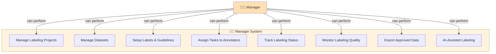
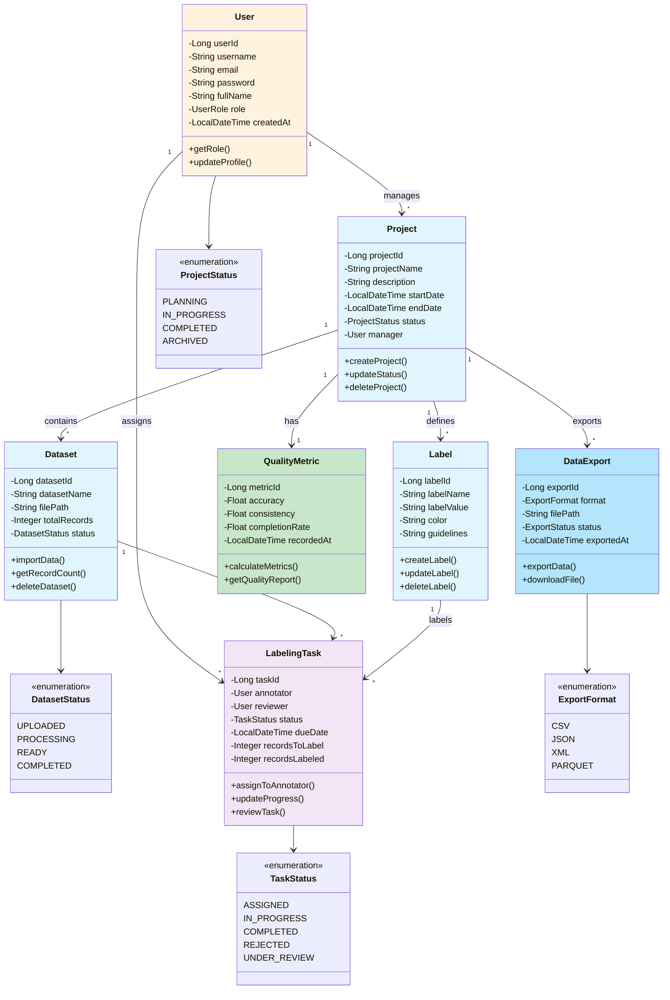
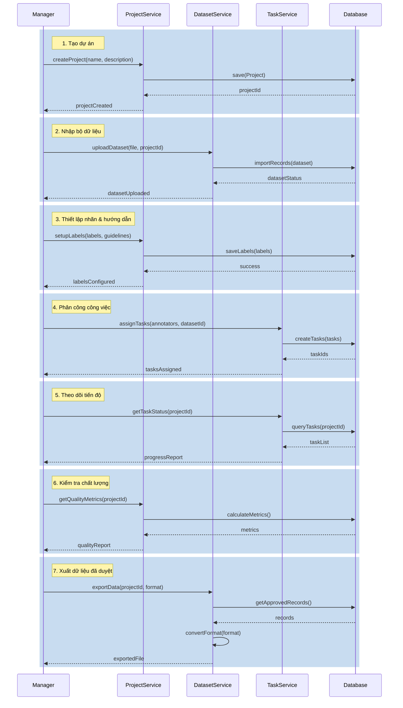
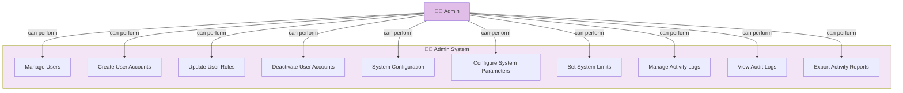
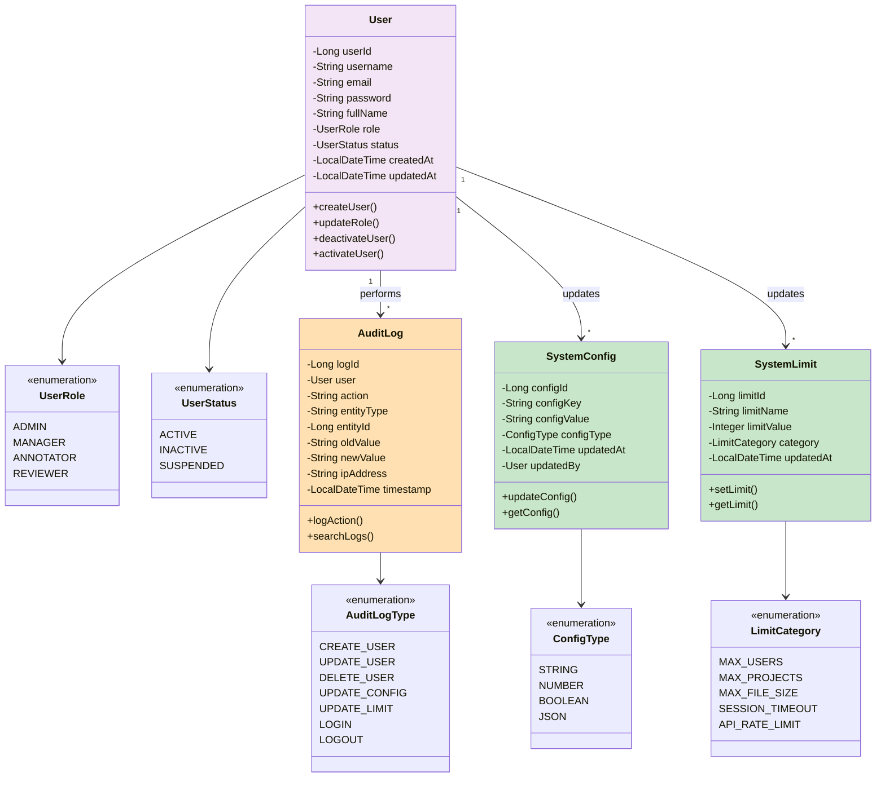
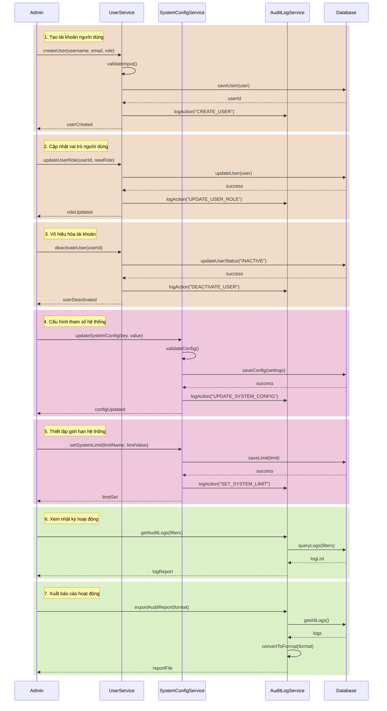

# 🏷️ Label Management System - Diagrams

## System Overview

Hệ thống quản lý gán nhãn dữ liệu (Data Labeling System) với các vai trò:

- **Manager**: Quản lý dự án, bộ dữ liệu, phân công công việc, theo dõi tiến độ
- **Admin**: Quản lý người dùng, cấu hình hệ thống, quản lý nhật ký hoạt động
- **Annotator**: Gán nhãn cho dữ liệu
- **Reviewer**: Duyệt chất lượng nhãn

---

# 👨‍💼 MANAGER DIAGRAMS

## 1️⃣ Manager - Use Case Diagram

### Manager Chức năng (7 use cases):
1. **Manage Labeling Projects** - Tạo, cập nhật, xóa dự án gán nhãn
2. **Manage Datasets** - Nhập, cập nhật, xóa bộ dữ liệu
3. **Setup Labels & Guidelines** - Định nghĩa nhãn, hướng dẫn gán nhãn
4. **Assign Tasks to Annotators** - Phân công công việc cho annotators
5. **Track Labeling Status** - Theo dõi tiến độ gán nhãn
6. **Monitor Labeling Quality** - Kiểm tra chất lượng nhãn
7. **Export Approved Data** - Xuất dữ liệu đã duyệt
8. **AI-Assisted Labeling** - Hỗ trợ gán nhãn bằng AI (tùy chọn)

---

## 2️⃣ Manager - Class Diagram

### Manager Class Model:
- **User**: Manager (vai trò MANAGER)
- **Project**: Dự án được tạo & quản lý bởi Manager
- **Dataset**: Bộ dữ liệu trong project
- **Label**: Danh sách nhãn
- **LabelingTask**: Công việc được phân công
- **QualityMetric**: Chỉ số chất lượng
- **DataExport**: Xuất dữ liệu

---

## 3️⃣ Manager - Sequence Diagram

### Manager Workflow (7 bước):
1. **Tạo dự án** → ProjectService save
2. **Nhập bộ dữ liệu** → DatasetService import
3. **Thiết lập nhãn** → Setup configuration
4. **Phân công công việc** → Create tasks
5. **Theo dõi tiến độ** → Query status
6. **Kiểm tra chất lượng** → Calculate metrics
7. **Xuất dữ liệu** → Export approved data

---

# 👨‍💻 ADMIN DIAGRAMS

## 4️⃣ Admin - Use Case Diagram

### Admin Chức năng (10 use cases):
**Quản lý Người dùng (4):**
1. **Manage Users** - Quản lý toàn bộ tài khoản
2. **Create User Accounts** - Tạo tài khoản mới
3. **Update User Roles** - Cập nhật vai trò người dùng
4. **Deactivate User Accounts** - Vô hiệu hóa tài khoản

**Cấu hình Hệ thống (3):**
5. **System Configuration** - Quản lý cấu hình chung
6. **Configure System Parameters** - Thiết lập tham số hệ thống
7. **Set System Limits** - Thiết lập giới hạn (tải, người dùng, v.v.)

**Quản lý Nhật ký (3):**
8. **Manage Activity Logs** - Quản lý nhật ký
9. **View Audit Logs** - Xem lịch sử hoạt động
10. **Export Activity Reports** - Xuất báo cáo

---

## 5️⃣ Admin - Class Diagram

### Admin Class Model:
- **User**: Quản lý người dùng (ADMIN, MANAGER, ANNOTATOR, REVIEWER)
- **UserStatus**: ACTIVE, INACTIVE, SUSPENDED
- **SystemConfig**: Cấu hình hệ thống (key-value)
- **SystemLimit**: Giới hạn hệ thống
- **AuditLog**: Nhật ký hoạt động
- **AuditLogType**: Loại action được log

---

## 6️⃣ Admin - Sequence Diagram

### Admin Workflow (7 bước):
**Quản lý Người dùng (3):**
1. **Tạo tài khoản** → Validate, save, log action
2. **Cập nhật vai trò** → Update role, log change
3. **Vô hiệu hóa tài khoản** → Deactivate, log action

**Cấu hình Hệ thống (2):**
4. **Cấu hình tham số** → Validate, save settings
5. **Thiết lập giới hạn** → Set limits

**Quản lý Nhật ký (2):**
6. **Xem logs** → Query audit logs
7. **Xuất báo cáo** → Export report

---

## Architecture Stack

### Manager Workflow (7 bước):
1. **Tạo dự án** → ProjectService save
2. **Nhập bộ dữ liệu** → DatasetService import
3. **Thiết lập nhãn** → Setup configuration
4. **Phân công công việc** → Create tasks
5. **Theo dõi tiến độ** → Query status
6. **Kiểm tra chất lượng** → Calculate metrics
7. **Xuất dữ liệu** → Export approved data

---

# 👨‍💻 ADMIN DIAGRAMS

## 4️⃣ Admin - Use Case Diagram

### Admin Chức năng (10 use cases):
**Quản lý Người dùng (4):**
1. **Manage Users** - Quản lý toàn bộ tài khoản
2. **Create User Accounts** - Tạo tài khoản mới
3. **Update User Roles** - Cập nhật vai trò người dùng
4. **Deactivate User Accounts** - Vô hiệu hóa tài khoản

**Cấu hình Hệ thống (3):**
5. **System Configuration** - Quản lý cấu hình chung
6. **Configure System Parameters** - Thiết lập tham số hệ thống
7. **Set System Limits** - Thiết lập giới hạn (tải, người dùng, v.v.)

**Quản lý Nhật ký (3):**
8. **Manage Activity Logs** - Quản lý nhật ký
9. **View Audit Logs** - Xem lịch sử hoạt động
10. **Export Activity Reports** - Xuất báo cáo

---

## 5️⃣ Admin - Class Diagram

### Admin Class Model:
- **User**: Quản lý người dùng (ADMIN, MANAGER, ANNOTATOR, REVIEWER)
- **UserStatus**: ACTIVE, INACTIVE, SUSPENDED
- **SystemConfig**: Cấu hình hệ thống (key-value)
- **SystemLimit**: Giới hạn hệ thống
- **AuditLog**: Nhật ký hoạt động
- **AuditLogType**: Loại action được log

---

## 6️⃣ Admin - Sequence Diagram

### Admin Workflow (7 bước):
**Quản lý Người dùng (3):**
1. **Tạo tài khoản** → Validate, save, log action
2. **Cập nhật vai trò** → Update role, log change
3. **Vô hiệu hóa tài khoản** → Deactivate, log action

**Cấu hình Hệ thống (2):**
4. **Cấu hình tham số** → Validate, save settings
5. **Thiết lập giới hạn** → Set limits

**Quản lý Nhật ký (2):**
6. **Xem logs** → Query audit logs
7. **Xuất báo cáo** → Export report

---

## Architecture Stack

- **Backend**: Spring Boot 4.0.5 + Java 21
- **Database**: JPA/Hibernate
- **Frontend**: React + Vite
- **AI Service**: Python (YOLOv8)
- **API Documentation**: OpenAPI/Swagger

---

## Notes

✅ Tất cả chức năng của Manager đã hoàn thành (7/7)
✅ Quản lý người dùng & nhật ký của Admin đã hoàn thành (2/3)
⏳ Cấu hình hệ thống của Admin (1/3) - chưa có chức năng
🔄 AI hỗ trợ gán nhãn - tùy chọn, có AIService sẵn sàng

---

Last Updated: 2026-04-25
