# 1. Introduction

## 1.1 Purpose
The purpose of this Software Requirements Specification (SRS) document is to provide a detailed description of the Data Labeling Platform. This document follows the IEEE 29148 standard. It will illustrate the purpose and complete declaration for the development of the system. It explains system constraints, interface requirements, and interactions with external entities.

## 1.2 Scope
The **Data Labeling Platform** is a web-based system designed to facilitate and manage the process of annotating data (primarily images) for Machine Learning and AI projects. The system supports full project management, role-based access control (RBAC), data item tracking, manual annotation (bounding boxes using YOLO format), review workflows (approval/rejection), and data export capabilities. 

Key objectives include:
- Centralized management of annotation projects.
- Efficient allocation of data to Annotators.
- Quality assurance through a Reviewer role.
- Secure storage of image data using Cloudinary.
- Seamless authentication via Google OAuth2.

## 1.3 Definitions, Acronyms, and Abbreviations
- **SRS**: Software Requirements Specification
- **RBAC**: Role-Based Access Control
- **JWT**: JSON Web Token
- **API**: Application Programming Interface
- **YOLO**: You Only Look Once (A format for object detection bounding boxes: xCenter, yCenter, width, height)
- **OAUTH2**: Open Authorization protocol
- **ER**: Entity-Relationship
- **UML**: Unified Modeling Language

## 1.4 References
- IEEE Std 29148-2018: Systems and software engineering — Life cycle processes — Requirements engineering.
- Project Source Code Repository: Spring Boot 4.0.5, MySQL 8.
- OAuth 2.0 Authorization Framework (RFC 6749).

## 1.5 Document Overview
The remainder of this document is organized as follows:
- **Section 2** provides a general overview of the system, including stakeholders, user roles, constraints, and assumptions.
- **Section 3** specifies detailed requirements: functional requirements, non-functional requirements, data requirements (data dictionary), and API specifications.
- **Section 4** presents UML diagrams representing system design and workflow.
- **Section 5** contains the Requirement Traceability Matrix (RTM).

---

# 2. Overall Description

## 2.1 System Perspective
The Data Labeling Platform is an independent, self-contained web application operating on a client-server architecture. 
- **Backend**: Built with Java Spring Boot, exposing RESTful APIs.
- **Database**: MySQL 8 used for relational data persistence.
- **Storage**: External integration with Cloudinary for handling and serving image uploads.
- **Frontend**: A React/Next.js based UI (implied in `/data-labeling ui` folder).

## 2.2 System Functions
The system provides the following major functions:
- **Authentication & Security**: Local login, Google OAuth2, JWT generation and validation, token blacklisting.
- **User Management**: Registration, profile updates, role and permission assignment.
- **Project Management**: Creating projects, assigning managers, managing project members (Annotators, Reviewers), and dashboard analytics.
- **Data Item Management**: Uploading data files, assigning labels, tracking data status (UNLABELED, LABELED, REVIEWING, APPROVED, REJECTED).
- **Annotation**: Creating and managing annotations (YOLO format bounding boxes) for data items.
- **Review System**: Approving or rejecting annotated data, tracking review logs and reasons.
- **Export & Audit**: Exporting approved datasets for AI training, auditing all system actions for security compliance.
- **System Configuration**: Managing global system settings dynamically (e.g., enabling/disabling registration, maintenance mode).

## 2.3 User Characteristics
The system targets four primary user groups (Stakeholders):

1. **Administrator (ADMIN)**
   - **Characteristics**: Technical users responsible for system maintenance.
   - **Responsibilities**: Manage users, assign roles, monitor audit logs, manage system configurations, full access to all projects.

2. **Project Manager (MANAGER)**
   - **Characteristics**: Operational leaders organizing data labeling campaigns.
   - **Responsibilities**: Create projects, define labels, upload data items, assign Annotators and Reviewers to projects, monitor progress via dashboards, and export final datasets.

3. **Annotator (ANNOTATOR)**
   - **Characteristics**: Data entry operators or domain experts who label data.
   - **Responsibilities**: View assigned projects, fetch unlabeled/rejected data items, draw bounding boxes (annotations), and submit data for review.

4. **Reviewer (REVIEWER)**
   - **Characteristics**: Senior annotators or Quality Assurance (QA) personnel.
   - **Responsibilities**: Inspect submitted annotations, approve correct data, and reject incorrect data with comments (ReviewLogs).

## 2.4 General Constraints
- **Regulatory**: The system must comply with data privacy policies; user passwords must be hashed (Bcrypt).
- **Hardware Limitations**: Image uploads are constrained by Cloudinary's tier limits.
- **Technology Constraints**: Backend must run on Java 21+ and Spring Boot 4.0.5+.

## 2.5 Assumptions and Dependencies
- **Assumptions**: 
  - Users have modern web browsers (Chrome, Firefox, Edge).
  - Administrators will secure the database credentials and JWT Secret Key.
- **Dependencies**: 
  - Depends on Cloudinary API for image storage.
  - Depends on Google OAuth2 API for Single Sign-On (SSO).
  - MySQL Database must be highly available to prevent application crashes.

# 3. Specific Requirements

## 3.1 Functional Requirements

This section outlines the detailed functional requirements of the system, complete with Use Cases, Main/Alternative Flows, and Acceptance Criteria.

### 3.1.1 Authentication & Security Module (FR-01)
**Description:** The system must provide secure mechanisms for users to authenticate and maintain sessions.

**Use Case 1: Local Login**
- **Preconditions:** The user has registered an account and is active.
- **Main Flow:**
  1. User enters username and password.
  2. System validates credentials against the database.
  3. System generates a JWT access token and refresh token.
  4. System returns the tokens to the client.
- **Alternative Flow:** 
  - (2a) User enters wrong password. System returns 401 Unauthorized.
- **Postconditions:** User is authenticated and can access secured endpoints.
- **Acceptance Criteria:** 
  - Passwords must be hashed using Bcrypt.
  - Token must contain User ID, Roles, and Permissions in claims.

**Use Case 2: Google OAuth2 Login**
- **Preconditions:** User has a valid Google account.
- **Main Flow:**
  1. User clicks "Login with Google".
  2. Client receives Google ID token and sends it to backend `/api/auth/google`.
  3. Backend validates the Google token.
  4. If user doesn't exist, system auto-registers the user.
  5. System generates JWT and returns it.
- **Postconditions:** User is logged in via SSO.

**Use Case 3: Logout**
- **Main Flow:**
  1. User clicks logout.
  2. Client sends current JWT to `/api/auth/logout`.
  3. System adds the token ID (JTI) to the `invalidated_token` table.
- **Acceptance Criteria:** Blacklisted tokens cannot be used to access APIs, returning 401.

### 3.1.2 User Management Module (FR-02)
**Description:** The system allows administrators to manage users and their roles/permissions.

**Use Case 4: Manage Users (CRUD)**
- **Preconditions:** User has `MANAGE_USER` permission (usually ADMIN).
- **Main Flow:**
  1. Admin requests to view the user list.
  2. Admin can create, update, or delete a user.
  3. Admin can assign `Role` (ADMIN, MANAGER, ANNOTATOR, REVIEWER) to a user.
- **Acceptance Criteria:** Deleting a user with assigned tasks must either cascade delete tasks or restrict deletion.

### 3.1.3 Project Management Module (FR-03)
**Description:** Capabilities to organize annotation work into Projects.

**Use Case 5: Create and Configure Project**
- **Preconditions:** User has `MANAGE_PROJECT` permission.
- **Main Flow:**
  1. User inputs Project Name, Description, and Reviewer ID.
  2. System creates the Project with status `DRAFT`.
  3. Manager adds `Labels` (Name and Color) to the Project.
  4. Manager adds `ProjectMembers` (Users assigned to this project).
- **Postconditions:** A new project is created and ready to receive data.

### 3.1.4 Dataset Management Module (FR-04)
**Description:** Uploading and organizing images to be labeled.

**Use Case 6: Upload Data Items**
- **Preconditions:** Project exists and Manager is authenticated.
- **Main Flow:**
  1. Manager uploads an image file.
  2. System uploads the file to Cloudinary and retrieves the secure `fileUrl`.
  3. System creates a `DataItem` record linked to the Project with status `UNLABELED`.
- **Exception Flow:** Cloudinary API fails -> System aborts database save and returns 500 Error.

### 3.1.5 Annotation Workflow Module (FR-05)
**Description:** The core labeling functionality.

**Use Case 7: Annotate Data Item**
- **Preconditions:** User is ANNOTATOR and is a member of the project.
- **Main Flow:**
  1. Annotator requests the next `UNLABELED` or `REJECTED` item in the project.
  2. System returns the DataItem.
  3. Annotator draws bounding boxes and submits `Annotations` (label, xCenter, yCenter, width, height).
  4. System saves Annotations, updates DataItem status to `REVIEWING`.
- **Alternative Flow:**
  - Annotator skips the item. Status remains unchanged.
- **Acceptance Criteria:** Tightly coupled Business Rule: Annotators can only access projects they are assigned to (Enforce BOLA/IDOR protection).

### 3.1.6 Review Workflow Module (FR-06)
**Description:** Quality assurance for annotations.

**Use Case 8: Approve/Reject Data**
- **Preconditions:** User has `REVIEW_DATA` permission.
- **Main Flow (Approve):**
  1. Reviewer fetches a `REVIEWING` data item.
  2. Reviewer clicks Approve.
  3. System changes DataItem status to `APPROVED`.
  4. System records action in `ReviewLog`.
- **Alternative Flow (Reject):**
  1. Reviewer clicks Reject and provides a `rejectReason`.
  2. System changes status to `REJECTED`.
  3. System records in `ReviewLog`.
- **Postconditions:** Item is ready for export (if approved) or re-annotation (if rejected).

### 3.1.7 Export and Audit Module (FR-07)
**Description:** Outputting data and tracing activities.

**Use Case 9: Export Dataset**
- **Preconditions:** User has `EXPORT_DATA` permission.
- **Main Flow:**
  1. User requests export for a specific Project.
  2. System gathers all `APPROVED` data items and their annotations.
  3. System formats output as JSON/CSV/YOLO text files.
  4. System returns the file to the client.

**Use Case 10: System Audit Logging**
- **Description:** Every sensitive API call (Create, Update, Delete) is intercepted (likely via AOP/Interceptor) and a record is created in `AuditLog` containing username, action, target entity, details, IP address, and timestamp.

## 3.2 Non-Functional Requirements

### 3.2.1 Performance Requirements
- **Response Time:** API endpoints (excluding file uploads) must respond within 500ms under normal load.
- **Throughput:** The system must handle concurrent annotation submissions from at least 100 users.

### 3.2.2 Security Requirements
- **Authentication:** All endpoints except `/api/auth/**` must require a valid JWT.
- **Authorization:** Method-level security (e.g., `@PreAuthorize`) must be implemented to check permissions against user roles.
- **Data Protection:** Passwords must not be stored in plain text. JWT Tokens must be signed using HMAC SHA-512 with a minimum 256-bit secret key.

### 3.2.3 Reliability and Availability
- **Cloud Dependency:** The system depends on Cloudinary for image delivery. If Cloudinary is down, the system should gracefully fail and alert the user.
- **Database Transactions:** Operations spanning multiple tables (e.g., deleting a user and their tokens) must be transactional to prevent orphaned records.

### 3.2.4 Maintainability
- The backend codebase must follow clean architecture principles, separating Controllers, Services, and Repositories.
- MapStruct should be used for all DTO to Entity conversions to avoid boilerplate code.

## 3.3 Business Rules
- **BR-01 (Role Exclusivity):** An ADMIN has all permissions implicitly.
- **BR-02 (Data Privacy):** A user cannot view `DataItems` of a `Project` unless they are explicitly added to the `ProjectMember` table or have the `MANAGE_PROJECT` system-wide permission.
- **BR-03 (State Machine):** A `DataItem` must follow the transition: `UNLABELED` -> `REVIEWING` -> (`APPROVED` or `REJECTED`). `REJECTED` -> `REVIEWING`. Only `APPROVED` data can be exported.
- **BR-04 (Maintenance Mode):** If `SystemConfig` key `SYSTEM_MAINTENANCE` is set to `true`, only ADMIN users can log in or perform actions.

## 3.4 Data Requirements & Data Dictionary

This section describes the logical data entities and their attributes required to support the system functionalities. 

### 3.4.1 Data Entities (Data Dictionary)

**Table 1: User**
Stores system user information.
| Attribute | Data Type | Description | Key |
|-----------|-----------|-------------|-----|
| id | UUID (String) | Unique identifier for the user | PK |
| username | String | Unique login name | Unique |
| password | String | Hashed password | - |
| firstName | String | User's first name | - |
| lastName | String | User's last name | - |
| email | String | User's email address | Unique |
| dateOfBirth | Date | User's date of birth | - |

**Table 2: Role**
Stores RBAC roles.
| Attribute | Data Type | Description | Key |
|-----------|-----------|-------------|-----|
| name | String | Role name (e.g., ADMIN) | PK |
| description | String | Detailed description | - |

**Table 3: Permission**
Stores granular permissions.
| Attribute | Data Type | Description | Key |
|-----------|-----------|-------------|-----|
| name | String | Permission name (e.g., MANAGE_USER) | PK |
| description | String | Detailed description | - |

**Table 4: Project**
Stores information about annotation projects.
| Attribute | Data Type | Description | Key |
|-----------|-----------|-------------|-----|
| id | UUID | Unique project identifier | PK |
| name | String | Name of the project | - |
| description | Text | Instructions or details | - |
| status | Enum | ProjectStatus (DRAFT, etc.) | - |
| manager_id | UUID | User ID of project manager | FK |
| reviewer_id | UUID | User ID of default reviewer | FK |
| createdAt | DateTime | Creation timestamp | - |
| updatedAt | DateTime | Last updated timestamp | - |

**Table 5: DataItem**
Stores images uploaded for annotation.
| Attribute | Data Type | Description | Key |
|-----------|-----------|-------------|-----|
| id | UUID | Unique item identifier | PK |
| fileName | String | Original file name | - |
| fileUrl | Text | Cloudinary URL | - |
| rejectReason | String | Reason for rejection | - |
| status | Enum | DataItemStatus | - |
| project_id | UUID | Belongs to project | FK |

**Table 6: Annotation**
Stores bounding box labels per DataItem.
| Attribute | Data Type | Description | Key |
|-----------|-----------|-------------|-----|
| id | UUID | Unique annotation identifier | PK |
| label_id | UUID | Linked Label | FK |
| xCenter | Double | YOLO X coordinate | - |
| yCenter | Double | YOLO Y coordinate | - |
| width | Double | YOLO Width | - |
| height | Double | YOLO Height | - |
| data_item_id | UUID | Linked DataItem | FK |
| user_id | UUID | Annotator who drew this | FK |

**Table 7: Label**
Stores valid labels for a project.
| Attribute | Data Type | Description | Key |
|-----------|-----------|-------------|-----|
| id | UUID | Unique label identifier | PK |
| name | String | Label text (e.g., "Car") | - |
| color | String | Hex color (e.g., "#FF0000") | - |
| project_id | UUID | Belongs to project | FK |

**Table 8: ReviewLog**
Stores history of reviewer actions.
| Attribute | Data Type | Description | Key |
|-----------|-----------|-------------|-----|
| id | UUID | Unique log identifier | PK |
| data_item_id | UUID | Linked DataItem | FK |
| reviewer_id | UUID | Linked User | FK |
| comment | Text | Reason for action | - |
| createdAt | DateTime | Timestamp of review | - |

**Table 9: AuditLog**
Stores all sensitive system actions.
| Attribute | Data Type | Description | Key |
|-----------|-----------|-------------|-----|
| id | UUID | Log identifier | PK |
| username | String | Who performed action | - |
| action | String | CRUD action | - |
| targetEntity | String | Affected entity | - |
| details | String | Extra context | - |
| ipAddress | String | Source IP | - |
| status | String | SUCCESS/FAIL | - |
| timestamp | DateTime | When action occurred | - |

**Table 10: SystemConfig**
Dynamic system settings.
| Attribute | Data Type | Description | Key |
|-----------|-----------|-------------|-----|
| config_key | String | Setting Key (e.g., MAINT) | PK |
| config_value | Text | Value | - |
| description | String | Contextual help | - |

**Table 11: InvalidatedToken**
Blacklisted JWT tokens from logout.
| Attribute | Data Type | Description | Key |
|-----------|-----------|-------------|-----|
| id | String | JWT JTI | PK |
| expiryTime | Date | Expiration of token | - |

## 3.5 External Interface Requirements

### 3.5.1 User Interfaces
The system provides a web-based User Interface (SPA) built with React/Next.js. It features dashboards for Project Managers, a bounding box Canvas for Annotators, and an approval table for Reviewers.

### 3.5.2 Hardware Interfaces
No specific hardware interfaces beyond a standard computer monitor for the user interface, with mouse support for drawing accurate annotations.

### 3.5.3 Software Interfaces
- **Database System:** MySQL 8.0 running on default port 3306.
- **Cloud Storage:** Cloudinary API for image uploads and CDN delivery.
- **Authentication:** Google OAuth2 API endpoints.

### 3.5.4 Communication Interfaces
- **Protocol:** HTTP/HTTPS over TCP/IP.
- **Data Format:** JSON for all Request/Response bodies in the REST API.

## 3.6 API Specifications

This section specifies the RESTful endpoints used by the platform.

### 3.6.1 Authentication API
**POST `/api/auth/token`**
- **Description:** Authenticate user and issue JWT.
- **Request Body:** `{"username": "string", "password": "string"}`
- **Response Body:** `{"code": 1000, "result": {"token": "jwt_string", "authenticated": true}}`
- **Validation Rules:** Username and password cannot be blank.
- **Error Codes:** 401 Unauthorized (Invalid credentials).

**POST `/api/auth/google`**
- **Description:** Login using Google OAuth2.
- **Request Body:** `{"token": "google_id_token"}`
- **Response Body:** `{"code": 1000, "result": {"token": "jwt_string"}}`
- **Validation Rules:** Token must be a valid Google-issued JWT.

### 3.6.2 User API
**POST `/api/users/register`**
- **Description:** Create a new user account.
- **Request Body:** `{"username": "str", "password": "str", "email": "str"}`
- **Response Body:** User profile data without password.
- **Validation Rules:** Username and Email must be unique. Password > 6 chars.
- **Error Codes:** 400 Bad Request (Duplicate username).

**GET `/api/users/myInfor`**
- **Description:** Retrieve current authenticated user's info.
- **Header:** `Authorization: Bearer <jwt>`
- **Response Body:** `{ "id": "...", "username": "...", "roles": [...] }`

### 3.6.3 Project API
**POST `/api/projects`**
- **Description:** Create a new annotation project.
- **Header:** `Authorization: Bearer <jwt>`
- **Request Body:** `{"name": "Detect Cars", "description": "...", "reviewerId": "..."}`
- **Response Body:** Project entity.
- **Validation Rules:** User must have MANAGE_PROJECT permission.

### 3.6.4 Annotation API
**POST `/api/annotations`**
- **Description:** Submit annotations for a DataItem.
- **Header:** `Authorization: Bearer <jwt>`
- **Request Body:** 
  ```json
  {
    "dataItemId": "uuid",
    "annotations": [
      {"labelId": "uuid", "xCenter": 0.5, "yCenter": 0.5, "width": 0.1, "height": 0.1}
    ]
  }
  ```
- **Response Body:** Success message.
- **Validation Rules:** Coordinates must be between 0 and 1. DataItem status must be UNLABELED or REJECTED.

---

# 4. UML Artifacts (System Models) — Chi tiết theo từng luồng chức năng

Phần này trình bày các diagram UML chi tiết, **bám sát 100% source code thực tế** của hệ thống. Mỗi diagram được tạo riêng cho từng luồng chức năng để giảng viên có thể đối chiếu trực tiếp với code.

---

## 4.1 Use Case Diagrams

### 4.1.1 Use Case Diagram Tổng quan hệ thống


```plantuml
@startuml
left to right direction
skinparam packageStyle rectangle

actor "Administrator" as Admin
actor "Project Manager" as Manager
actor "Annotator" as Annotator
actor "Reviewer" as Reviewer

rectangle "Data Labeling Platform" {
  package "Authentication Module" {
    usecase "UC-01: Đăng nhập bằng Username/Password" as UC01
    usecase "UC-02: Đăng nhập bằng Google OAuth2" as UC02
    usecase "UC-03: Đăng xuất (Logout)" as UC03
    usecase "UC-04: Làm mới Token (Refresh)" as UC04
    usecase "UC-05: Kiểm tra Token (Introspect)" as UC05
    usecase "UC-06: Đăng ký tài khoản mới" as UC06
  }

  package "User Management Module" {
    usecase "UC-07: Tạo User (Admin)" as UC07
    usecase "UC-08: Xem danh sách User" as UC08
    usecase "UC-09: Cập nhật User" as UC09
    usecase "UC-10: Xóa User" as UC10
    usecase "UC-11: Xem thông tin cá nhân" as UC11
  }

  package "Project Management Module" {
    usecase "UC-12: Tạo Project mới" as UC12
    usecase "UC-13: Xem danh sách Project" as UC13
    usecase "UC-14: Cập nhật Project" as UC14
    usecase "UC-15: Xóa Project" as UC15
    usecase "UC-16: Thêm thành viên vào Project" as UC16
    usecase "UC-17: Xóa thành viên khỏi Project" as UC17
    usecase "UC-18: Xem Dashboard thống kê" as UC18
    usecase "UC-19: Xem danh sách Project được giao" as UC19
  }

  package "Dataset Management Module" {
    usecase "UC-20: Upload ảnh vào Project" as UC20
    usecase "UC-21: Xem danh sách ảnh trong Project" as UC21
    usecase "UC-22: Xóa ảnh" as UC22
    usecase "UC-23: Lấy ảnh tiếp theo để gán nhãn" as UC23
    usecase "UC-24: Gợi ý nhãn từ AI" as UC24
  }

  package "Annotation Module" {
    usecase "UC-25: Gán nhãn (Bounding Box YOLO)" as UC25
    usecase "UC-26: Xem nhãn đã gán cho ảnh" as UC26
  }

  package "Review Module" {
    usecase "UC-27: Xem ảnh chờ duyệt" as UC27
    usecase "UC-28: Duyệt ảnh (Approve)" as UC28
    usecase "UC-29: Từ chối ảnh (Reject)" as UC29
    usecase "UC-30: Xem Project review được giao" as UC30
  }

  package "Export Module" {
    usecase "UC-31: Xuất Dataset YOLO" as UC31
    usecase "UC-32: Xuất Dataset COCO" as UC32
    usecase "UC-33: Xuất Dataset VOC" as UC33
  }

  package "System Administration Module" {
    usecase "UC-34: Quản lý Role" as UC34
    usecase "UC-35: Quản lý Permission" as UC35
    usecase "UC-36: Cấu hình hệ thống" as UC36
    usecase "UC-37: Xem Audit Log" as UC37
  }
}

' === Authentication ===
Admin --> UC01
Manager --> UC01
Annotator --> UC01
Reviewer --> UC01
Admin --> UC02
Manager --> UC02
Annotator --> UC02
Reviewer --> UC02
Admin --> UC03
Manager --> UC03
Annotator --> UC03
Reviewer --> UC03

' === User ===
Admin --> UC07
Admin --> UC08
Admin --> UC09
Admin --> UC10
Manager --> UC08
Admin --> UC11
Manager --> UC11
Annotator --> UC11
Reviewer --> UC11

' === Registration (Public) ===
Annotator --> UC06

' === Project ===
Admin --> UC12
Manager --> UC12
Admin --> UC13
Manager --> UC13
Admin --> UC14
Manager --> UC14
Admin --> UC15
Manager --> UC15
Admin --> UC16
Manager --> UC16
Admin --> UC17
Manager --> UC17
Admin --> UC18
Manager --> UC18
Annotator --> UC19

' === Dataset ===
Manager --> UC20
Manager --> UC21
Manager --> UC22
Annotator --> UC23
Annotator --> UC24

' === Annotation ===
Annotator --> UC25
Annotator --> UC26

' === Review ===
Reviewer --> UC27
Reviewer --> UC28
Reviewer --> UC29
Reviewer --> UC30

' === Export ===
Manager --> UC31
Manager --> UC32
Manager --> UC33

' === System Admin ===
Admin --> UC34
Admin --> UC35
Admin --> UC36
Admin --> UC37

@enduml
```

### 4.1.2 Use Case Diagram — Module Authentication (Chi tiết)

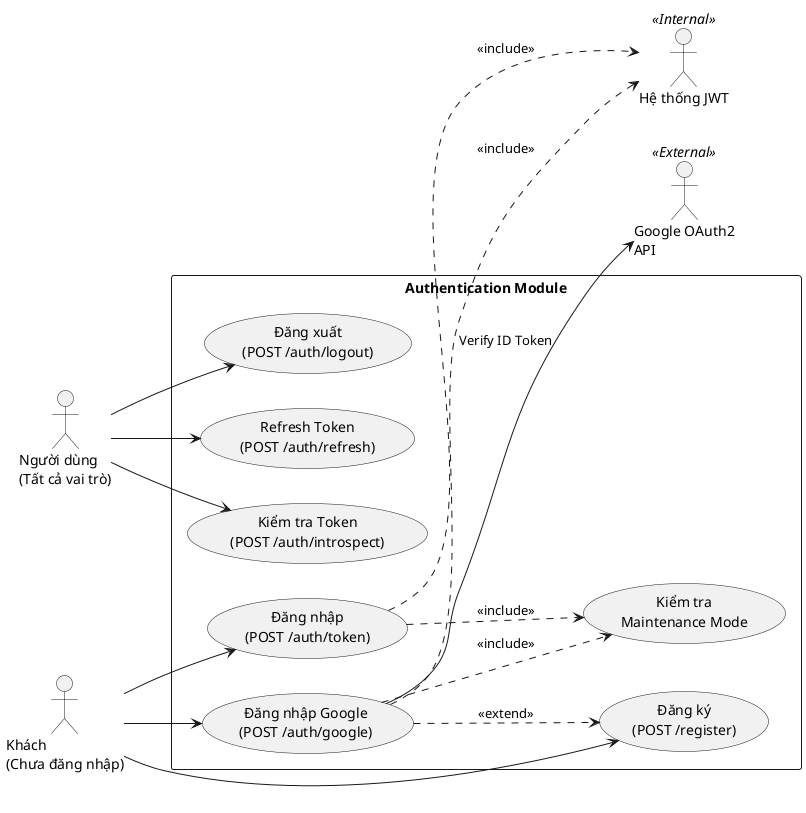
```plantuml
@startuml
left to right direction
skinparam packageStyle rectangle

actor "Người dùng\n(Tất cả vai trò)" as User
actor "Khách\n(Chưa đăng nhập)" as Guest
actor "Google OAuth2\nAPI" as Google <<External>>
actor "Hệ thống JWT" as JWT <<Internal>>

rectangle "Authentication Module" {
  usecase "Đăng nhập\n(POST /auth/token)" as Login
  usecase "Đăng nhập Google\n(POST /auth/google)" as GLogin
  usecase "Đăng xuất\n(POST /auth/logout)" as Logout
  usecase "Refresh Token\n(POST /auth/refresh)" as Refresh
  usecase "Kiểm tra Token\n(POST /auth/introspect)" as Introspect
  usecase "Đăng ký\n(POST /register)" as Register
  usecase "Kiểm tra\nMaintenance Mode" as MaintCheck

  Login ..> MaintCheck : <<include>>
  GLogin ..> MaintCheck : <<include>>
  Login ..> JWT : <<include>>
  GLogin ..> JWT : <<include>>
  GLogin ..> Register : <<extend>>
}

Guest --> Login
Guest --> GLogin
Guest --> Register
User --> Logout
User --> Refresh
User --> Introspect

GLogin --> Google : Verify ID Token
@enduml
```

### 4.1.3 Use Case Diagram — Module Project Management (Chi tiết)

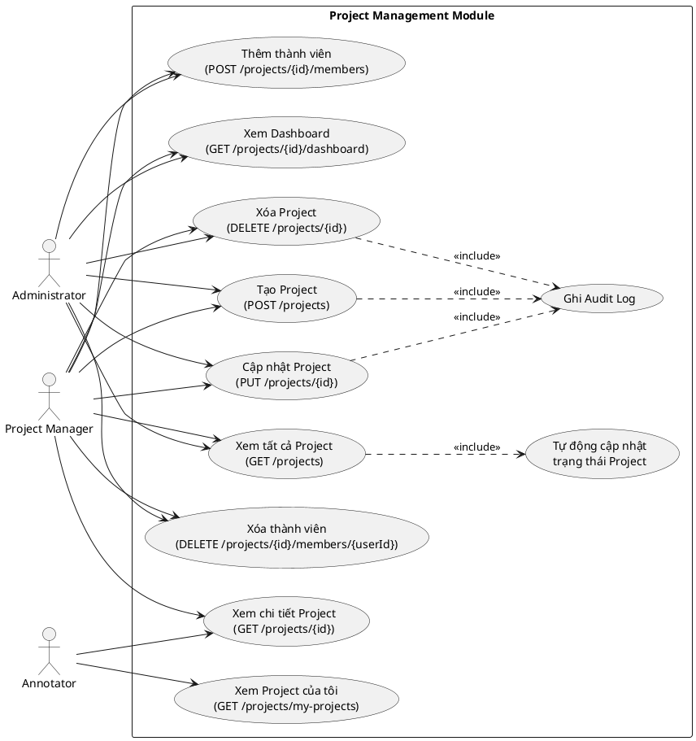
```plantuml
@startuml
left to right direction
skinparam packageStyle rectangle

actor "Administrator" as Admin
actor "Project Manager" as Manager
actor "Annotator" as Annotator

rectangle "Project Management Module" {
  usecase "Tạo Project\n(POST /projects)" as Create
  usecase "Xem tất cả Project\n(GET /projects)" as ViewAll
  usecase "Xem chi tiết Project\n(GET /projects/{id})" as ViewOne
  usecase "Cập nhật Project\n(PUT /projects/{id})" as Update
  usecase "Xóa Project\n(DELETE /projects/{id})" as Delete
  usecase "Thêm thành viên\n(POST /projects/{id}/members)" as AddMember
  usecase "Xóa thành viên\n(DELETE /projects/{id}/members/{userId})" as RemoveMember
  usecase "Xem Dashboard\n(GET /projects/{id}/dashboard)" as Dashboard
  usecase "Xem Project của tôi\n(GET /projects/my-projects)" as MyProjects
  usecase "Tự động cập nhật\ntrạng thái Project" as AutoStatus
  usecase "Ghi Audit Log" as AuditLog

  ViewAll ..> AutoStatus : <<include>>
  Create ..> AuditLog : <<include>>
  Update ..> AuditLog : <<include>>
  Delete ..> AuditLog : <<include>>
}

Admin --> Create
Admin --> ViewAll
Admin --> Update
Admin --> Delete
Admin --> AddMember
Admin --> RemoveMember
Admin --> Dashboard
Manager --> Create
Manager --> ViewAll
Manager --> ViewOne
Manager --> Update
Manager --> Delete
Manager --> AddMember
Manager --> RemoveMember
Manager --> Dashboard
Annotator --> MyProjects
Annotator --> ViewOne
@enduml
```

### 4.1.4 Use Case Diagram — Module Annotation & Review (Chi tiết)

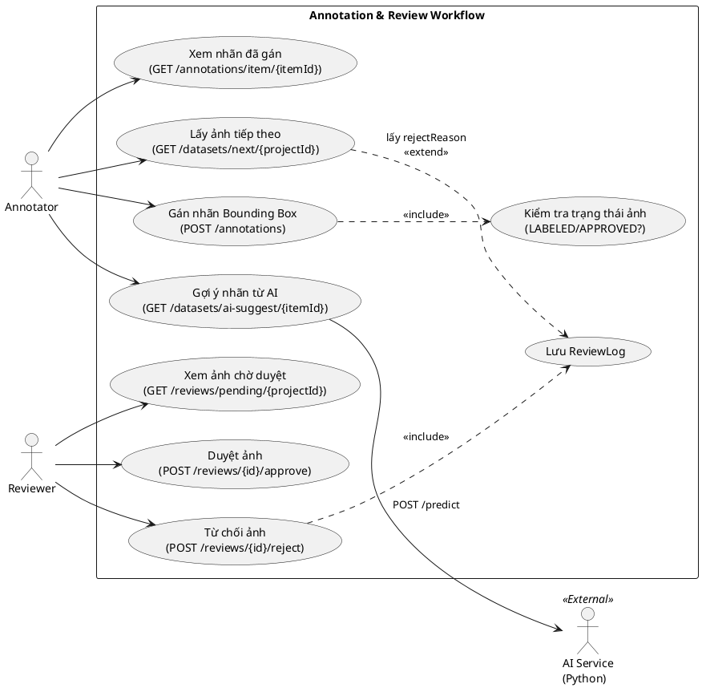
```plantuml
@startuml
left to right direction
skinparam packageStyle rectangle

actor "Annotator" as Ann
actor "Reviewer" as Rev
actor "AI Service\n(Python)" as AI <<External>>

rectangle "Annotation & Review Workflow" {
  usecase "Lấy ảnh tiếp theo\n(GET /datasets/next/{projectId})" as NextItem
  usecase "Gợi ý nhãn từ AI\n(GET /datasets/ai-suggest/{itemId})" as AISuggest
  usecase "Gán nhãn Bounding Box\n(POST /annotations)" as Annotate
  usecase "Xem nhãn đã gán\n(GET /annotations/item/{itemId})" as ViewAnn
  usecase "Xem ảnh chờ duyệt\n(GET /reviews/pending/{projectId})" as Pending
  usecase "Duyệt ảnh\n(POST /reviews/{id}/approve)" as Approve
  usecase "Từ chối ảnh\n(POST /reviews/{id}/reject)" as Reject
  usecase "Lưu ReviewLog" as SaveLog
  usecase "Kiểm tra trạng thái ảnh\n(LABELED/APPROVED?)" as StatusCheck

  Annotate ..> StatusCheck : <<include>>
  Reject ..> SaveLog : <<include>>
  NextItem ..> SaveLog : lấy rejectReason\n<<extend>>
}

Ann --> NextItem
Ann --> AISuggest
Ann --> Annotate
Ann --> ViewAnn
Rev --> Pending
Rev --> Approve
Rev --> Reject

AISuggest --> AI : POST /predict
@enduml
```

---

## 4.2 Sequence Diagrams — Chi tiết từng luồng chức năng

### 4.2.1 Sequence Diagram — Đăng nhập Local (POST /auth/token)
Luồng chính tại `AuthenticationController.authenticate()` → `AuthenticationService.authenticate()`.

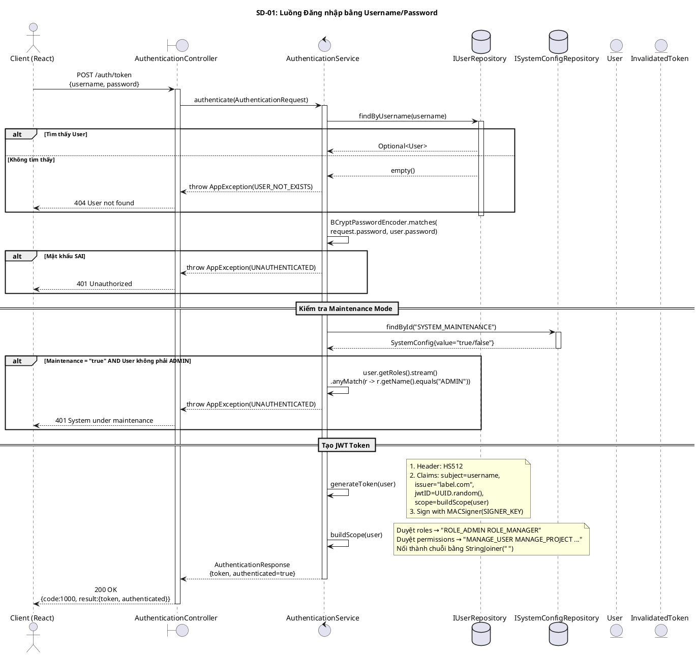
```plantuml
@startuml
skinparam sequenceMessageAlign center
title SD-01: Luồng Đăng nhập bằng Username/Password

actor "Client (React)" as Client
boundary "AuthenticationController" as Ctrl
control "AuthenticationService" as Svc
database "IUserRepository" as UserRepo
database "ISystemConfigRepository" as ConfigRepo
entity "User" as UserE
entity "InvalidatedToken" as Token

Client -> Ctrl: POST /auth/token\n{username, password}
activate Ctrl

Ctrl -> Svc: authenticate(AuthenticationRequest)
activate Svc

Svc -> UserRepo: findByUsername(username)
activate UserRepo
alt Tìm thấy User
    UserRepo --> Svc: Optional<User>
else Không tìm thấy
    UserRepo --> Svc: empty()
    Svc --> Ctrl: throw AppException(USER_NOT_EXISTS)
    Ctrl --> Client: 404 User not found
end
deactivate UserRepo

Svc -> Svc: BCryptPasswordEncoder.matches(\nrequest.password, user.password)
alt Mật khẩu SAI
    Svc --> Ctrl: throw AppException(UNAUTHENTICATED)
    Ctrl --> Client: 401 Unauthorized
end

== Kiểm tra Maintenance Mode ==
Svc -> ConfigRepo: findById("SYSTEM_MAINTENANCE")
activate ConfigRepo
ConfigRepo --> Svc: SystemConfig{value="true/false"}
deactivate ConfigRepo

alt Maintenance = "true" AND User không phải ADMIN
    Svc -> Svc: user.getRoles().stream()\n.anyMatch(r -> r.getName().equals("ADMIN"))
    Svc --> Ctrl: throw AppException(UNAUTHENTICATED)
    Ctrl --> Client: 401 System under maintenance
end

== Tạo JWT Token ==
Svc -> Svc: generateToken(user)
note right
  1. Header: HS512
  2. Claims: subject=username, 
     issuer="label.com",
     jwtID=UUID.random(),
     scope=buildScope(user)
  3. Sign with MACSigner(SIGNER_KEY)
end note

Svc -> Svc: buildScope(user)
note right
  Duyệt roles → "ROLE_ADMIN ROLE_MANAGER"
  Duyệt permissions → "MANAGE_USER MANAGE_PROJECT ..."
  Nối thành chuỗi bằng StringJoiner(" ")
end note

Svc --> Ctrl: AuthenticationResponse\n{token, authenticated=true}
deactivate Svc

Ctrl --> Client: 200 OK\n{code:1000, result:{token, authenticated}}
deactivate Ctrl
@enduml
```

### 4.2.2 Sequence Diagram — Đăng nhập Google OAuth2 (POST /auth/google)
Luồng tại `AuthenticationService.authenticateWithGoogle()`.

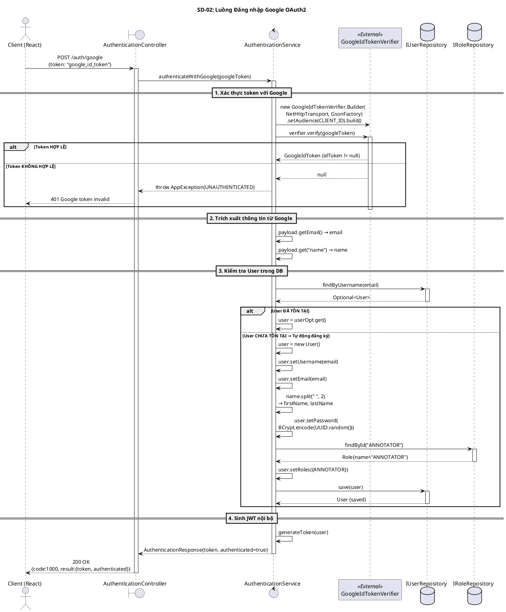
```plantuml
@startuml
skinparam sequenceMessageAlign center
title SD-02: Luồng Đăng nhập Google OAuth2

actor "Client (React)" as Client
boundary "AuthenticationController" as Ctrl
control "AuthenticationService" as Svc
participant "GoogleIdTokenVerifier" as Google <<External>>
database "IUserRepository" as UserRepo
database "IRoleRepository" as RoleRepo

Client -> Ctrl: POST /auth/google\n{token: "google_id_token"}
activate Ctrl

Ctrl -> Svc: authenticateWithGoogle(googleToken)
activate Svc

== 1. Xác thực token với Google ==
Svc -> Google: new GoogleIdTokenVerifier.Builder(\n  NetHttpTransport, GsonFactory)\n  .setAudience(CLIENT_ID).build()
Svc -> Google: verifier.verify(googleToken)
activate Google

alt Token HỢP LỆ
    Google --> Svc: GoogleIdToken (idToken != null)
else Token KHÔNG HỢP LỆ
    Google --> Svc: null
    Svc --> Ctrl: throw AppException(UNAUTHENTICATED)
    Ctrl --> Client: 401 Google token invalid
end
deactivate Google

== 2. Trích xuất thông tin từ Google ==
Svc -> Svc: payload.getEmail() → email
Svc -> Svc: payload.get("name") → name

== 3. Kiểm tra User trong DB ==
Svc -> UserRepo: findByUsername(email)
activate UserRepo
UserRepo --> Svc: Optional<User>
deactivate UserRepo

alt User ĐÃ TỒN TẠI
    Svc -> Svc: user = userOpt.get()
else User CHƯA TỒN TẠI → Tự động đăng ký
    Svc -> Svc: user = new User()
    Svc -> Svc: user.setUsername(email)
    Svc -> Svc: user.setEmail(email)
    Svc -> Svc: name.split(" ", 2)\n→ firstName, lastName
    Svc -> Svc: user.setPassword(\nBCrypt.encode(UUID.random()))
    
    Svc -> RoleRepo: findById("ANNOTATOR")
    activate RoleRepo
    RoleRepo --> Svc: Role{name="ANNOTATOR"}
    deactivate RoleRepo
    
    Svc -> Svc: user.setRoles({ANNOTATOR})
    Svc -> UserRepo: save(user)
    activate UserRepo
    UserRepo --> Svc: User (saved)
    deactivate UserRepo
end

== 4. Sinh JWT nội bộ ==
Svc -> Svc: generateToken(user)
Svc --> Ctrl: AuthenticationResponse{token, authenticated=true}
deactivate Svc

Ctrl --> Client: 200 OK\n{code:1000, result:{token, authenticated}}
deactivate Ctrl
@enduml
```

### 4.2.3 Sequence Diagram — Logout & Refresh Token
Luồng tại `AuthenticationService.logout()` và `AuthenticationService.refreshToken()`.

```plantuml
@startuml
skinparam sequenceMessageAlign center
title SD-03: Luồng Đăng xuất (Logout) và Refresh Token

actor "Client" as Client
boundary "AuthenticationController" as Ctrl
control "AuthenticationService" as Svc
database "IInvalidatedTokenRepository" as TokenRepo
database "IUserRepository" as UserRepo

== LOGOUT FLOW ==
Client -> Ctrl: POST /auth/logout\n{token: "current_jwt"}
activate Ctrl
Ctrl -> Svc: logout(LogoutRequest)
activate Svc

Svc -> Svc: verifyToken(token, isRefresh=true)
note right
  1. Parse JWT → SignedJWT
  2. Verify chữ ký HMAC (SIGNER_KEY)
  3. Kiểm tra hạn (refreshable duration)
  4. Kiểm tra JTI chưa bị blacklist
end note

alt Token HỢP LỆ
    Svc -> Svc: jit = signedJWT.getJWTClaimsSet().getJWTID()
    Svc -> Svc: expiryTime = signedJWT.getExpirationTime()
    Svc -> TokenRepo: save(InvalidatedToken{id=jit, expiryTime})
    activate TokenRepo
    TokenRepo --> Svc: saved
    deactivate TokenRepo
else Token KHÔNG HỢP LỆ
    Svc -> Svc: log.warn("Invalid token")
    note right: Không throw exception,\nchỉ log warning rồi bỏ qua
end

Svc --> Ctrl: void
deactivate Svc
Ctrl --> Client: 200 OK {code:1000}
deactivate Ctrl

== REFRESH TOKEN FLOW ==
Client -> Ctrl: POST /auth/refresh\n{token: "old_jwt"}
activate Ctrl
Ctrl -> Svc: refreshToken(RefreshRequest)
activate Svc

Svc -> Svc: verifyToken(token, isRefresh=true)
note right
  Kiểm tra issueTime + REFRESHABLE_DURATION
  thay vì expirationTime
end note

Svc -> Svc: jit = old JTI
Svc -> TokenRepo: save(InvalidatedToken{id=old_jit, expiryTime})
note right: Vô hiệu hóa token CŨ\nngay sau khi refresh
end note

Svc -> Svc: username = signedJWT.getSubject()
Svc -> UserRepo: findByUsername(username)
activate UserRepo
UserRepo --> Svc: User
deactivate UserRepo

Svc -> Svc: generateToken(user) → new JWT
Svc --> Ctrl: AuthenticationResponse{token=new, authenticated=true}
deactivate Svc
Ctrl --> Client: 200 OK {token: new_jwt}
deactivate Ctrl
@enduml
```

### 4.2.4 Sequence Diagram — Tạo Project mới (POST /projects)
Luồng tại `ProjectController.createProject()` → `ProjectService.createProject()`.

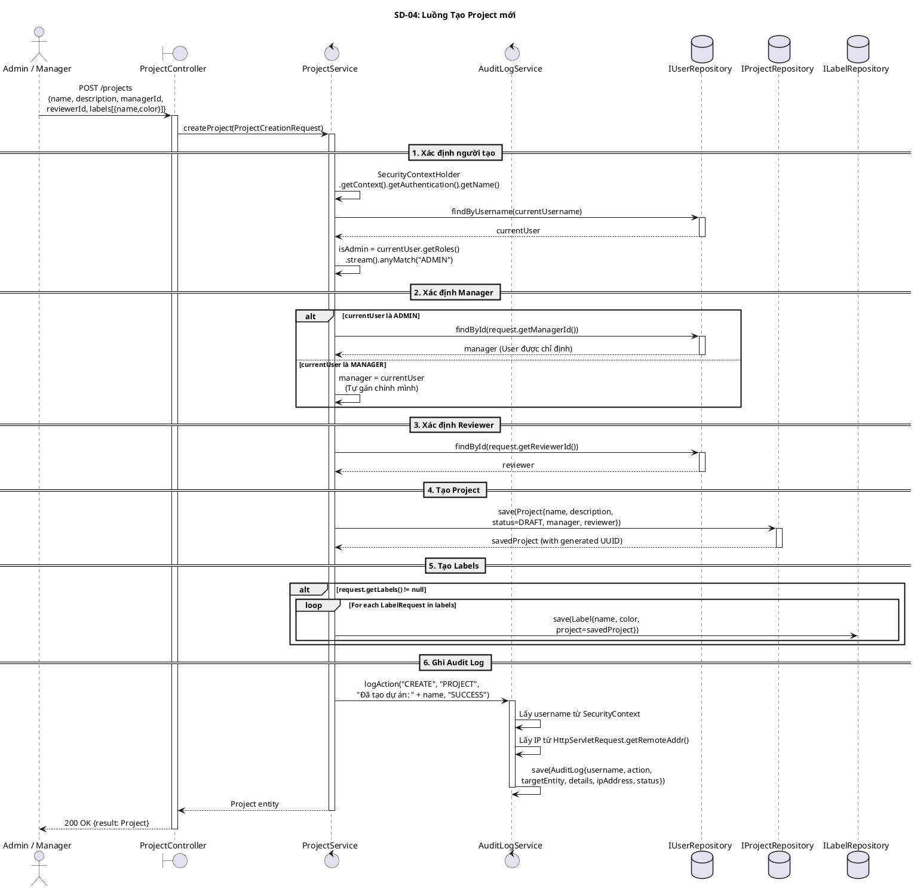
```plantuml
@startuml
skinparam sequenceMessageAlign center
title SD-04: Luồng Tạo Project mới

actor "Admin / Manager" as Client
boundary "ProjectController" as Ctrl
control "ProjectService" as Svc
control "AuditLogService" as Audit
database "IUserRepository" as UserRepo
database "IProjectRepository" as ProjRepo
database "ILabelRepository" as LabelRepo

Client -> Ctrl: POST /projects\n{name, description, managerId,\n reviewerId, labels[{name,color}]}
activate Ctrl
Ctrl -> Svc: createProject(ProjectCreationRequest)
activate Svc

== 1. Xác định người tạo ==
Svc -> Svc: SecurityContextHolder\n.getContext().getAuthentication().getName()
Svc -> UserRepo: findByUsername(currentUsername)
activate UserRepo
UserRepo --> Svc: currentUser
deactivate UserRepo

Svc -> Svc: isAdmin = currentUser.getRoles()\n.stream().anyMatch("ADMIN")

== 2. Xác định Manager ==
alt currentUser là ADMIN
    Svc -> UserRepo: findById(request.getManagerId())
    activate UserRepo
    UserRepo --> Svc: manager (User được chỉ định)
    deactivate UserRepo
else currentUser là MANAGER
    Svc -> Svc: manager = currentUser\n(Tự gán chính mình)
end

== 3. Xác định Reviewer ==
Svc -> UserRepo: findById(request.getReviewerId())
activate UserRepo
UserRepo --> Svc: reviewer
deactivate UserRepo

== 4. Tạo Project ==
Svc -> ProjRepo: save(Project{name, description,\n status=DRAFT, manager, reviewer})
activate ProjRepo
ProjRepo --> Svc: savedProject (with generated UUID)
deactivate ProjRepo

== 5. Tạo Labels ==
alt request.getLabels() != null
    loop For each LabelRequest in labels
        Svc -> LabelRepo: save(Label{name, color,\n project=savedProject})
    end
end

== 6. Ghi Audit Log ==
Svc -> Audit: logAction("CREATE", "PROJECT",\n "Đã tạo dự án: " + name, "SUCCESS")
activate Audit
Audit -> Audit: Lấy username từ SecurityContext
Audit -> Audit: Lấy IP từ HttpServletRequest.getRemoteAddr()
Audit -> Audit: save(AuditLog{username, action,\n targetEntity, details, ipAddress, status})
deactivate Audit

Svc --> Ctrl: Project entity
deactivate Svc
Ctrl --> Client: 200 OK {result: Project}
deactivate Ctrl
@enduml
```

### 4.2.5 Sequence Diagram — Upload ảnh vào Project (POST /datasets/upload)
Luồng tại `DatasetController.uploadDataset()` → `DatasetService.uploadAndSaveDataset()`.

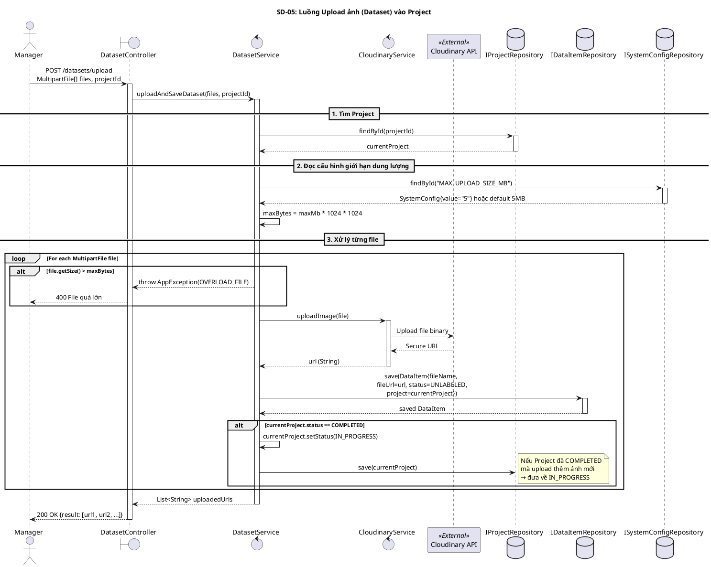
```plantuml
@startuml
skinparam sequenceMessageAlign center
title SD-05: Luồng Upload ảnh (Dataset) vào Project

actor "Manager" as Client
boundary "DatasetController" as Ctrl
control "DatasetService" as Svc
control "CloudinaryService" as Cloud
participant "Cloudinary API" as CloudAPI <<External>>
database "IProjectRepository" as ProjRepo
database "IDataItemRepository" as ItemRepo
database "ISystemConfigRepository" as ConfigRepo

Client -> Ctrl: POST /datasets/upload\nMultipartFile[] files, projectId
activate Ctrl
Ctrl -> Svc: uploadAndSaveDataset(files, projectId)
activate Svc

== 1. Tìm Project ==
Svc -> ProjRepo: findById(projectId)
activate ProjRepo
ProjRepo --> Svc: currentProject
deactivate ProjRepo

== 2. Đọc cấu hình giới hạn dung lượng ==
Svc -> ConfigRepo: findById("MAX_UPLOAD_SIZE_MB")
activate ConfigRepo
ConfigRepo --> Svc: SystemConfig{value="5"} hoặc default 5MB
deactivate ConfigRepo
Svc -> Svc: maxBytes = maxMb * 1024 * 1024

== 3. Xử lý từng file ==
loop For each MultipartFile file
    alt file.getSize() > maxBytes
        Svc --> Ctrl: throw AppException(OVERLOAD_FILE)
        Ctrl --> Client: 400 File quá lớn
    end
    
    Svc -> Cloud: uploadImage(file)
    activate Cloud
    Cloud -> CloudAPI: Upload file binary
    CloudAPI --> Cloud: Secure URL
    Cloud --> Svc: url (String)
    deactivate Cloud
    
    Svc -> ItemRepo: save(DataItem{fileName,\n fileUrl=url, status=UNLABELED,\n project=currentProject})
    activate ItemRepo
    ItemRepo --> Svc: saved DataItem
    deactivate ItemRepo
    
    alt currentProject.status == COMPLETED
        Svc -> Svc: currentProject.setStatus(IN_PROGRESS)
        Svc -> ProjRepo: save(currentProject)
        note right: Nếu Project đã COMPLETED\nmà upload thêm ảnh mới\n→ đưa về IN_PROGRESS
    end
end

Svc --> Ctrl: List<String> uploadedUrls
deactivate Svc
Ctrl --> Client: 200 OK {result: [url1, url2, ...]}
deactivate Ctrl
@enduml
```

### 4.2.6 Sequence Diagram — Gán nhãn Annotation (POST /annotations)
Luồng tại `AnnotationController.save()` → `AnnotationService.saveAll()`.

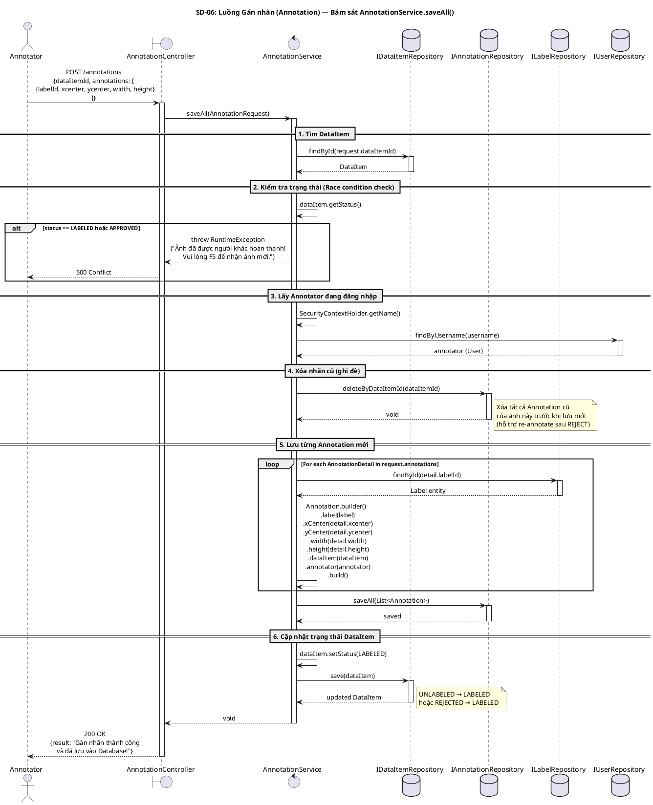
```plantuml
@startuml
skinparam sequenceMessageAlign center
title SD-06: Luồng Gán nhãn (Annotation) — Bám sát AnnotationService.saveAll()

actor "Annotator" as Client
boundary "AnnotationController" as Ctrl
control "AnnotationService" as Svc
database "IDataItemRepository" as ItemRepo
database "IAnnotationRepository" as AnnRepo
database "ILabelRepository" as LabelRepo
database "IUserRepository" as UserRepo

Client -> Ctrl: POST /annotations\n{dataItemId, annotations: [\n  {labelId, xcenter, ycenter, width, height}\n]}
activate Ctrl
Ctrl -> Svc: saveAll(AnnotationRequest)
activate Svc

== 1. Tìm DataItem ==
Svc -> ItemRepo: findById(request.dataItemId)
activate ItemRepo
ItemRepo --> Svc: DataItem
deactivate ItemRepo

== 2. Kiểm tra trạng thái (Race condition check) ==
Svc -> Svc: dataItem.getStatus()
alt status == LABELED hoặc APPROVED
    Svc --> Ctrl: throw RuntimeException\n("Ảnh đã được người khác hoàn thành!\n Vui lòng F5 để nhận ảnh mới.")
    Ctrl --> Client: 500 Conflict
end

== 3. Lấy Annotator đang đăng nhập ==
Svc -> Svc: SecurityContextHolder.getName()
Svc -> UserRepo: findByUsername(username)
activate UserRepo
UserRepo --> Svc: annotator (User)
deactivate UserRepo

== 4. Xóa nhãn cũ (ghi đè) ==
Svc -> AnnRepo: deleteByDataItemId(dataItemId)
activate AnnRepo
AnnRepo --> Svc: void
deactivate AnnRepo
note right: Xóa tất cả Annotation cũ\ncủa ảnh này trước khi lưu mới\n(hỗ trợ re-annotate sau REJECT)

== 5. Lưu từng Annotation mới ==
loop For each AnnotationDetail in request.annotations
    Svc -> LabelRepo: findById(detail.labelId)
    activate LabelRepo
    LabelRepo --> Svc: Label entity
    deactivate LabelRepo
    
    Svc -> Svc: Annotation.builder()\n  .label(label)\n  .xCenter(detail.xcenter)\n  .yCenter(detail.ycenter)\n  .width(detail.width)\n  .height(detail.height)\n  .dataItem(dataItem)\n  .annotator(annotator)\n  .build()
end

Svc -> AnnRepo: saveAll(List<Annotation>)
activate AnnRepo
AnnRepo --> Svc: saved
deactivate AnnRepo

== 6. Cập nhật trạng thái DataItem ==
Svc -> Svc: dataItem.setStatus(LABELED)
Svc -> ItemRepo: save(dataItem)
activate ItemRepo
ItemRepo --> Svc: updated DataItem
deactivate ItemRepo
note right: UNLABELED → LABELED\nhoặc REJECTED → LABELED

Svc --> Ctrl: void
deactivate Svc
Ctrl --> Client: 200 OK\n{result: "Gán nhãn thành công\nvà đã lưu vào Database!"}
deactivate Ctrl
@enduml
```

### 4.2.7 Sequence Diagram — Duyệt/Từ chối ảnh (Review Approve & Reject)
Luồng tại `ReviewController` → `ReviewService`.

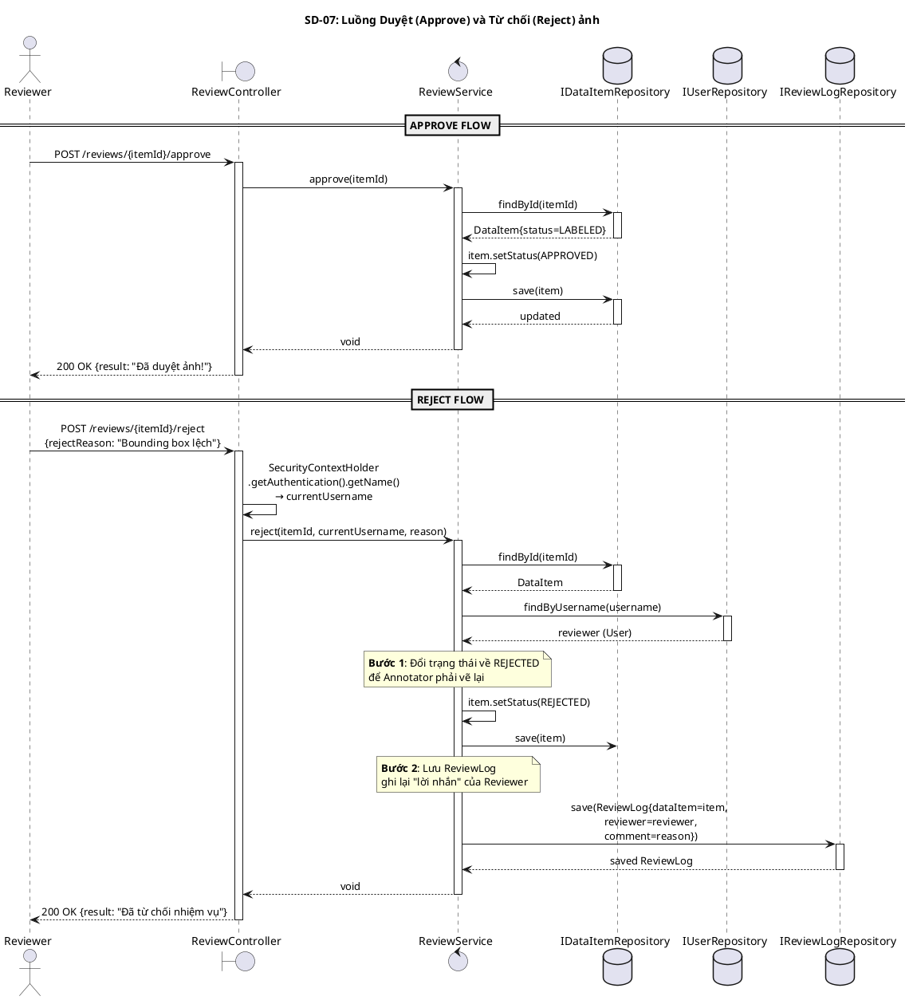
```plantuml
@startuml
skinparam sequenceMessageAlign center
title SD-07: Luồng Duyệt (Approve) và Từ chối (Reject) ảnh

actor "Reviewer" as Client
boundary "ReviewController" as Ctrl
control "ReviewService" as Svc
database "IDataItemRepository" as ItemRepo
database "IUserRepository" as UserRepo
database "IReviewLogRepository" as LogRepo

== APPROVE FLOW ==
Client -> Ctrl: POST /reviews/{itemId}/approve
activate Ctrl
Ctrl -> Svc: approve(itemId)
activate Svc

Svc -> ItemRepo: findById(itemId)
activate ItemRepo
ItemRepo --> Svc: DataItem{status=LABELED}
deactivate ItemRepo

Svc -> Svc: item.setStatus(APPROVED)
Svc -> ItemRepo: save(item)
activate ItemRepo
ItemRepo --> Svc: updated
deactivate ItemRepo

Svc --> Ctrl: void
deactivate Svc
Ctrl --> Client: 200 OK {result: "Đã duyệt ảnh!"}
deactivate Ctrl

== REJECT FLOW ==
Client -> Ctrl: POST /reviews/{itemId}/reject\n{rejectReason: "Bounding box lệch"}
activate Ctrl

Ctrl -> Ctrl: SecurityContextHolder\n.getAuthentication().getName()\n→ currentUsername
Ctrl -> Svc: reject(itemId, currentUsername, reason)
activate Svc

Svc -> ItemRepo: findById(itemId)
activate ItemRepo
ItemRepo --> Svc: DataItem
deactivate ItemRepo

Svc -> UserRepo: findByUsername(username)
activate UserRepo
UserRepo --> Svc: reviewer (User)
deactivate UserRepo

note over Svc
  **Bước 1**: Đổi trạng thái về REJECTED
  để Annotator phải vẽ lại
end note

Svc -> Svc: item.setStatus(REJECTED)
Svc -> ItemRepo: save(item)

note over Svc
  **Bước 2**: Lưu ReviewLog
  ghi lại "lời nhắn" của Reviewer
end note

Svc -> LogRepo: save(ReviewLog{dataItem=item,\n reviewer=reviewer,\n comment=reason})
activate LogRepo
LogRepo --> Svc: saved ReviewLog
deactivate LogRepo

Svc --> Ctrl: void
deactivate Svc
Ctrl --> Client: 200 OK {result: "Đã từ chối nhiệm vụ"}
deactivate Ctrl
@enduml
```

### 4.2.8 Sequence Diagram — Xuất Dataset (Export YOLO/COCO/VOC)
Luồng tại `ExportController` → `ExportService.exportDatasetFlexible()`.

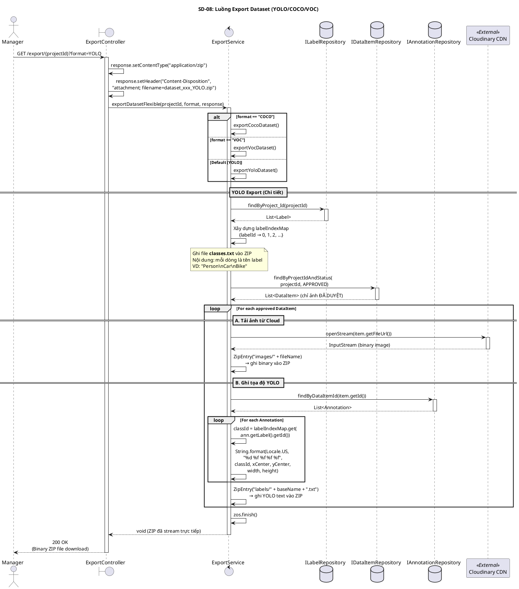
```plantuml
@startuml
skinparam sequenceMessageAlign center
title SD-08: Luồng Export Dataset (YOLO/COCO/VOC)

actor "Manager" as Client
boundary "ExportController" as Ctrl
control "ExportService" as Svc
database "ILabelRepository" as LabelRepo
database "IDataItemRepository" as ItemRepo
database "IAnnotationRepository" as AnnRepo
participant "Cloudinary CDN" as Cloud <<External>>

Client -> Ctrl: GET /export/{projectId}?format=YOLO
activate Ctrl

Ctrl -> Ctrl: response.setContentType("application/zip")
Ctrl -> Ctrl: response.setHeader("Content-Disposition",\n "attachment; filename=dataset_xxx_YOLO.zip")

Ctrl -> Svc: exportDatasetFlexible(projectId, format, response)
activate Svc

alt format == "COCO"
    Svc -> Svc: exportCocoDataset()
else format == "VOC"
    Svc -> Svc: exportVocDataset()
else Default (YOLO)
    Svc -> Svc: exportYoloDataset()
end

== YOLO Export (Chi tiết) ==

Svc -> LabelRepo: findByProject_Id(projectId)
activate LabelRepo
LabelRepo --> Svc: List<Label>
deactivate LabelRepo

Svc -> Svc: Xây dựng labelIndexMap\n{labelId → 0, 1, 2, ...}

note over Svc
  Ghi file **classes.txt** vào ZIP
  Nội dung: mỗi dòng là tên label
  VD: "Person\nCar\nBike"
end note

Svc -> ItemRepo: findByProjectIdAndStatus(\n  projectId, APPROVED)
activate ItemRepo
ItemRepo --> Svc: List<DataItem> (chỉ ảnh ĐÃ DUYỆT)
deactivate ItemRepo

loop For each approved DataItem
    == A. Tải ảnh từ Cloud ==
    Svc -> Cloud: openStream(item.getFileUrl())
    activate Cloud
    Cloud --> Svc: InputStream (binary image)
    deactivate Cloud
    Svc -> Svc: ZipEntry("images/" + fileName)\n→ ghi binary vào ZIP
    
    == B. Ghi tọa độ YOLO ==
    Svc -> AnnRepo: findByDataItemId(item.getId())
    activate AnnRepo
    AnnRepo --> Svc: List<Annotation>
    deactivate AnnRepo
    
    loop For each Annotation
        Svc -> Svc: classId = labelIndexMap.get(\nann.getLabel().getId())
        Svc -> Svc: String.format(Locale.US,\n "%d %f %f %f %f",\n classId, xCenter, yCenter,\n width, height)
    end
    Svc -> Svc: ZipEntry("labels/" + baseName + ".txt")\n→ ghi YOLO text vào ZIP
end

Svc -> Svc: zos.finish()
Svc --> Ctrl: void (ZIP đã stream trực tiếp)
deactivate Svc

Ctrl --> Client: 200 OK\n(Binary ZIP file download)
deactivate Ctrl
@enduml
```

### 4.2.9 Sequence Diagram — Đăng ký User & Tạo User bởi Admin
Luồng tại `UserController.registUser()` / `createUser()` → `UserService.createUser()`.

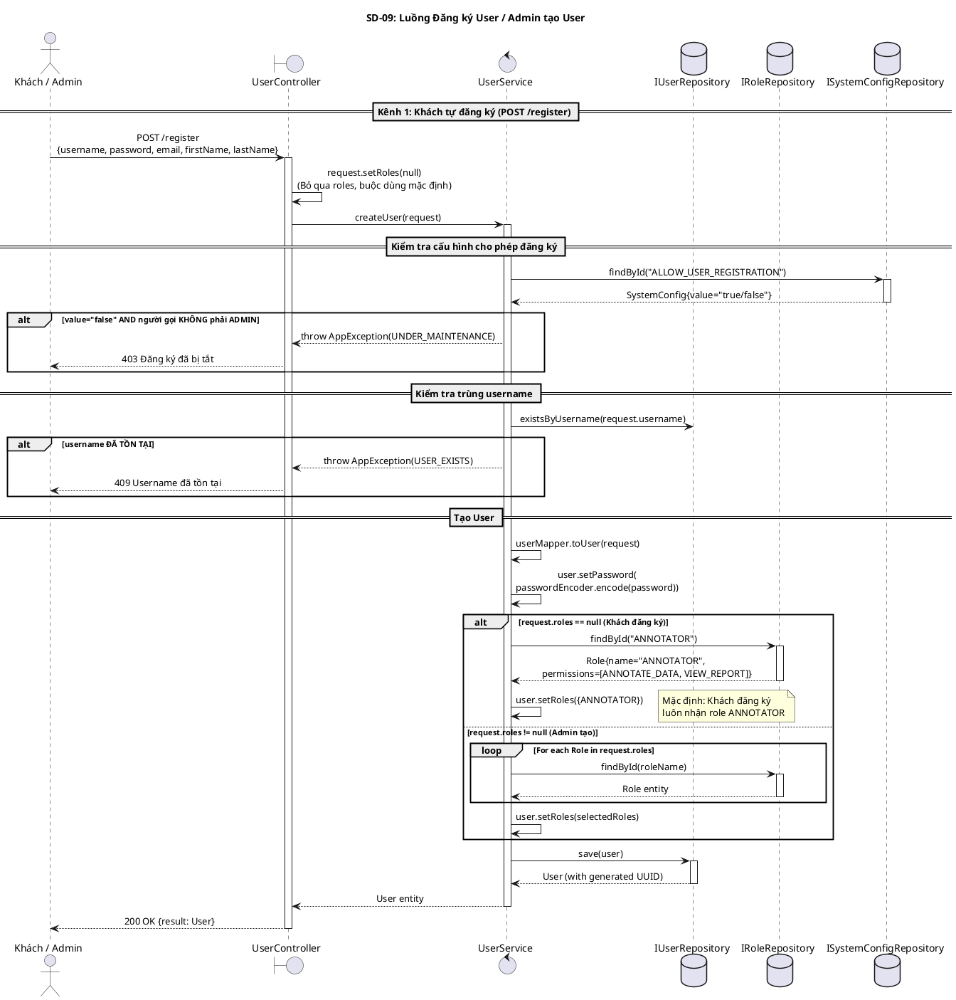
```plantuml
@startuml
skinparam sequenceMessageAlign center
title SD-09: Luồng Đăng ký User / Admin tạo User

actor "Khách / Admin" as Client
boundary "UserController" as Ctrl
control "UserService" as Svc
database "IUserRepository" as UserRepo
database "IRoleRepository" as RoleRepo
database "ISystemConfigRepository" as ConfigRepo

== Kênh 1: Khách tự đăng ký (POST /register) ==
Client -> Ctrl: POST /register\n{username, password, email, firstName, lastName}
activate Ctrl
Ctrl -> Ctrl: request.setRoles(null)\n(Bỏ qua roles, buộc dùng mặc định)
Ctrl -> Svc: createUser(request)
activate Svc

== Kiểm tra cấu hình cho phép đăng ký ==
Svc -> ConfigRepo: findById("ALLOW_USER_REGISTRATION")
activate ConfigRepo
ConfigRepo --> Svc: SystemConfig{value="true/false"}
deactivate ConfigRepo

alt value="false" AND người gọi KHÔNG phải ADMIN
    Svc --> Ctrl: throw AppException(UNDER_MAINTENANCE)
    Ctrl --> Client: 403 Đăng ký đã bị tắt
end

== Kiểm tra trùng username ==
Svc -> UserRepo: existsByUsername(request.username)
alt username ĐÃ TỒN TẠI
    Svc --> Ctrl: throw AppException(USER_EXISTS)
    Ctrl --> Client: 409 Username đã tồn tại
end

== Tạo User ==
Svc -> Svc: userMapper.toUser(request)
Svc -> Svc: user.setPassword(\npasswordEncoder.encode(password))

alt request.roles == null (Khách đăng ký)
    Svc -> RoleRepo: findById("ANNOTATOR")
    activate RoleRepo
    RoleRepo --> Svc: Role{name="ANNOTATOR",\n permissions=[ANNOTATE_DATA, VIEW_REPORT]}
    deactivate RoleRepo
    Svc -> Svc: user.setRoles({ANNOTATOR})
    note right: Mặc định: Khách đăng ký\nluôn nhận role ANNOTATOR
else request.roles != null (Admin tạo)
    loop For each Role in request.roles
        Svc -> RoleRepo: findById(roleName)
        activate RoleRepo
        RoleRepo --> Svc: Role entity
        deactivate RoleRepo
    end
    Svc -> Svc: user.setRoles(selectedRoles)
end

Svc -> UserRepo: save(user)
activate UserRepo
UserRepo --> Svc: User (with generated UUID)
deactivate UserRepo

Svc --> Ctrl: User entity
deactivate Svc
Ctrl --> Client: 200 OK {result: User}
deactivate Ctrl
@enduml
```

### 4.2.10 Sequence Diagram — JWT Validation (CustomJwtDecoder + SecurityFilterChain)
Luồng xác thực cho **mọi API request** có JWT.

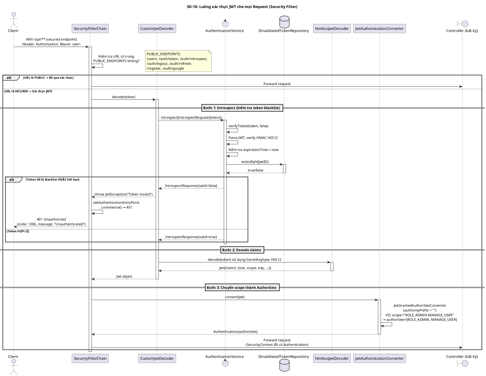
```plantuml
@startuml
skinparam sequenceMessageAlign center
title SD-10: Luồng xác thực JWT cho mọi Request (Security Filter)

actor "Client" as Client
participant "SecurityFilterChain" as Filter
participant "CustomJwtDecoder" as Decoder
control "AuthenticationService" as AuthSvc
database "IInvalidatedTokenRepository" as TokenRepo
participant "NimbusJwtDecoder" as Nimbus
participant "JwtAuthenticationConverter" as Converter
boundary "Controller (bất kỳ)" as Ctrl

Client -> Filter: ANY /api/** (secured endpoint)\nHeader: Authorization: Bearer <jwt>
activate Filter

Filter -> Filter: Kiểm tra URL có trong\nPUBLIC_ENDPOINTS không?
note right
  PUBLIC_ENDPOINTS:
  /users, /auth/token, /auth/introspect,
  /auth/logout, /auth/refresh,
  /register, /auth/google
end note

alt URL là PUBLIC → Bỏ qua xác thực
    Filter -> Ctrl: Forward request
else URL là SECURED → Xác thực JWT

    Filter -> Decoder: decode(token)
    activate Decoder
    
    == Bước 1: Introspect (kiểm tra token blacklist) ==
    Decoder -> AuthSvc: introspect(IntrospectRequest{token})
    activate AuthSvc
    AuthSvc -> AuthSvc: verifyToken(token, false)
    AuthSvc -> AuthSvc: Parse JWT, verify HMAC HS512
    AuthSvc -> AuthSvc: Kiểm tra expirationTime > now
    AuthSvc -> TokenRepo: existsById(jwtID)
    activate TokenRepo
    TokenRepo --> AuthSvc: true/false
    deactivate TokenRepo
    
    alt Token đã bị blacklist HOẶC hết hạn
        AuthSvc --> Decoder: IntrospectResponse{valid=false}
        Decoder --> Filter: throw JwtException("Token invalid")
        Filter -> Filter: JwtAuthenticationEntryPoint\n.commence() → 401
        Filter --> Client: 401 Unauthorized\n{code: 1006, message: "Unauthenticated"}
    else Token HỢP LỆ
        AuthSvc --> Decoder: IntrospectResponse{valid=true}
    end
    deactivate AuthSvc
    
    == Bước 2: Decode claims ==
    Decoder -> Nimbus: decode(token) sử dụng SecretKeySpec HS512
    activate Nimbus
    Nimbus --> Decoder: Jwt{claims: {sub, scope, exp, ...}}
    deactivate Nimbus
    
    Decoder --> Filter: Jwt object
    deactivate Decoder
    
    == Bước 3: Chuyển scope thành Authorities ==
    Filter -> Converter: convert(jwt)
    activate Converter
    Converter -> Converter: JwtGrantedAuthoritiesConverter\n(authorityPrefix = "")\nVD: scope="ROLE_ADMIN MANAGE_USER"\n→ authorities=[ROLE_ADMIN, MANAGE_USER]
    Converter --> Filter: Authentication{authorities}
    deactivate Converter
    
    Filter -> Ctrl: Forward request\n(SecurityContext đã có Authentication)
end
deactivate Filter
@enduml
```

---

## 4.3 Activity Diagrams

### 4.3.1 Activity Diagram — Vòng đời DataItem (State Machine)
Dựa trên enum `DataItemStatus` = {UNLABELED, LABELED, APPROVED, REJECTED}.

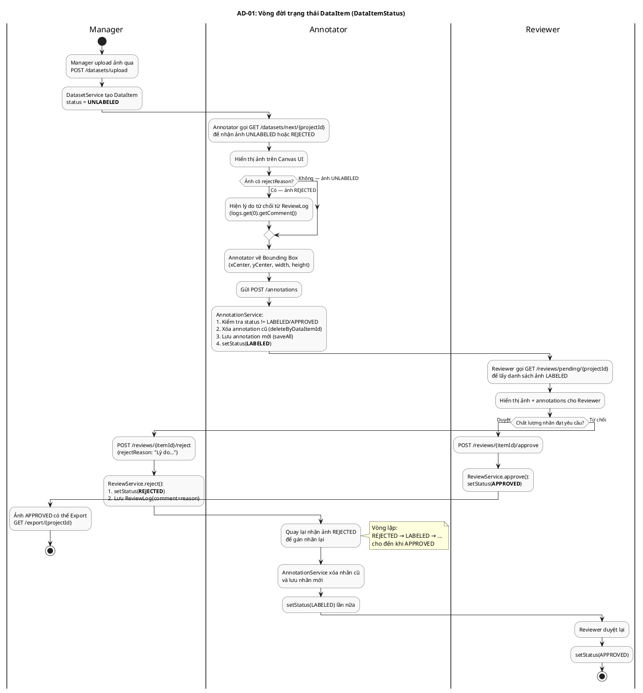
```plantuml
@startuml
skinparam ActivityBackgroundColor #f9f9f9
skinparam ActivityBorderColor #333
title AD-01: Vòng đời trạng thái DataItem (DataItemStatus)

|Manager|
start
:Manager upload ảnh qua\nPOST /datasets/upload;
:DatasetService tạo DataItem\nstatus = **UNLABELED**;

|Annotator|
:Annotator gọi GET /datasets/next/{projectId}\nđể nhận ảnh UNLABELED hoặc REJECTED;
:Hiển thị ảnh trên Canvas UI;

if (Ảnh có rejectReason?) then (Có — ảnh REJECTED)
  :Hiện lý do từ chối từ ReviewLog\n(logs.get(0).getComment());
else (Không — ảnh UNLABELED)
endif

:Annotator vẽ Bounding Box\n(xCenter, yCenter, width, height);
:Gửi POST /annotations;
:AnnotationService:\n1. Kiểm tra status != LABELED/APPROVED\n2. Xóa annotation cũ (deleteByDataItemId)\n3. Lưu annotation mới (saveAll)\n4. setStatus(**LABELED**);

|Reviewer|
:Reviewer gọi GET /reviews/pending/{projectId}\nđể lấy danh sách ảnh LABELED;
:Hiển thị ảnh + annotations cho Reviewer;

if (Chất lượng nhãn đạt yêu cầu?) then (Duyệt)
  :POST /reviews/{itemId}/approve;
  :ReviewService.approve():\nsetStatus(**APPROVED**);
  
  |Manager|
  :Ảnh APPROVED có thể Export\nGET /export/{projectId};
  stop
  
else (Từ chối)
  :POST /reviews/{itemId}/reject\n{rejectReason: "Lý do..."};
  :ReviewService.reject():\n1. setStatus(**REJECTED**)\n2. Lưu ReviewLog{comment=reason};
  
  |Annotator|
  :Quay lại nhận ảnh REJECTED\nđể gán nhãn lại;
  note right
    Vòng lặp:
    REJECTED → LABELED → ...
    cho đến khi APPROVED
  end note
  
  :AnnotationService xóa nhãn cũ\nvà lưu nhãn mới;
  :setStatus(LABELED) lần nữa;
  
  |Reviewer|
  :Reviewer duyệt lại;
  :setStatus(APPROVED);
  stop
endif

@enduml
```

### 4.3.2 Activity Diagram — Vòng đời Project (ProjectStatus)
Dựa trên enum `ProjectStatus` = {DRAFT, IN_PROGRESS, COMPLETED} và logic tự động tính toán trong `ProjectService.getAllProjects()`.

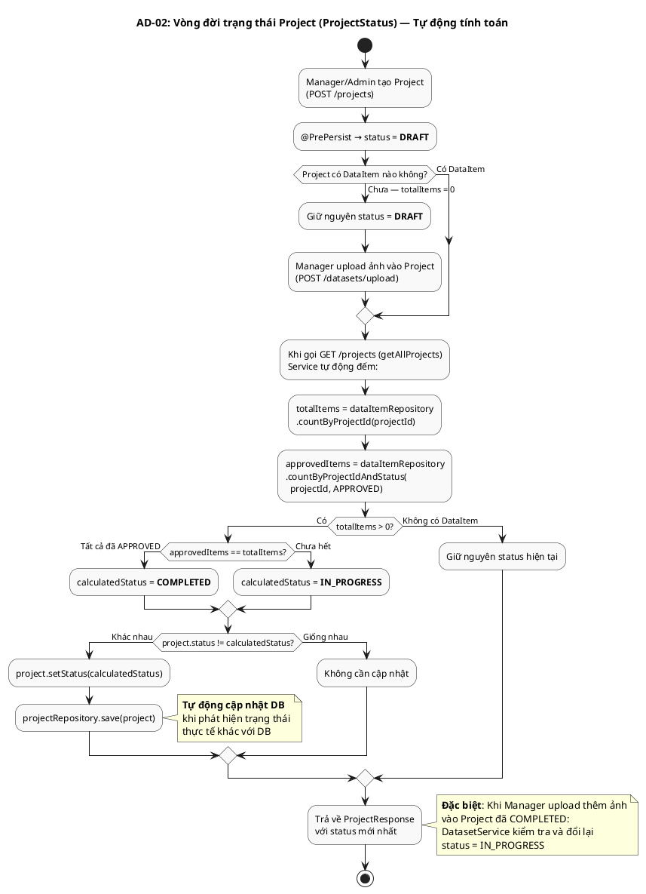
```plantuml
@startuml
skinparam ActivityBackgroundColor #f9f9f9
title AD-02: Vòng đời trạng thái Project (ProjectStatus) — Tự động tính toán

start
:Manager/Admin tạo Project\n(POST /projects);
:@PrePersist → status = **DRAFT**;

if (Project có DataItem nào không?) then (Chưa — totalItems = 0)
  :Giữ nguyên status = **DRAFT**;
  :Manager upload ảnh vào Project\n(POST /datasets/upload);
else (Có DataItem)
endif

:Khi gọi GET /projects (getAllProjects)\nService tự động đếm:;
:totalItems = dataItemRepository\n.countByProjectId(projectId);
:approvedItems = dataItemRepository\n.countByProjectIdAndStatus(\n  projectId, APPROVED);

if (totalItems > 0?) then (Có)
  if (approvedItems == totalItems?) then (Tất cả đã APPROVED)
    :calculatedStatus = **COMPLETED**;
  else (Chưa hết)
    :calculatedStatus = **IN_PROGRESS**;
  endif
  
  if (project.status != calculatedStatus?) then (Khác nhau)
    :project.setStatus(calculatedStatus);
    :projectRepository.save(project);
    note right
      **Tự động cập nhật DB**
      khi phát hiện trạng thái
      thực tế khác với DB
    end note
  else (Giống nhau)
    :Không cần cập nhật;
  endif
else (Không có DataItem)
  :Giữ nguyên status hiện tại;
endif

:Trả về ProjectResponse\nvới status mới nhất;

note right
  **Đặc biệt**: Khi Manager upload thêm ảnh
  vào Project đã COMPLETED:
  DatasetService kiểm tra và đổi lại
  status = IN_PROGRESS
end note

stop
@enduml
```

### 4.3.3 Activity Diagram — Toàn bộ Workflow hệ thống (End-to-End)

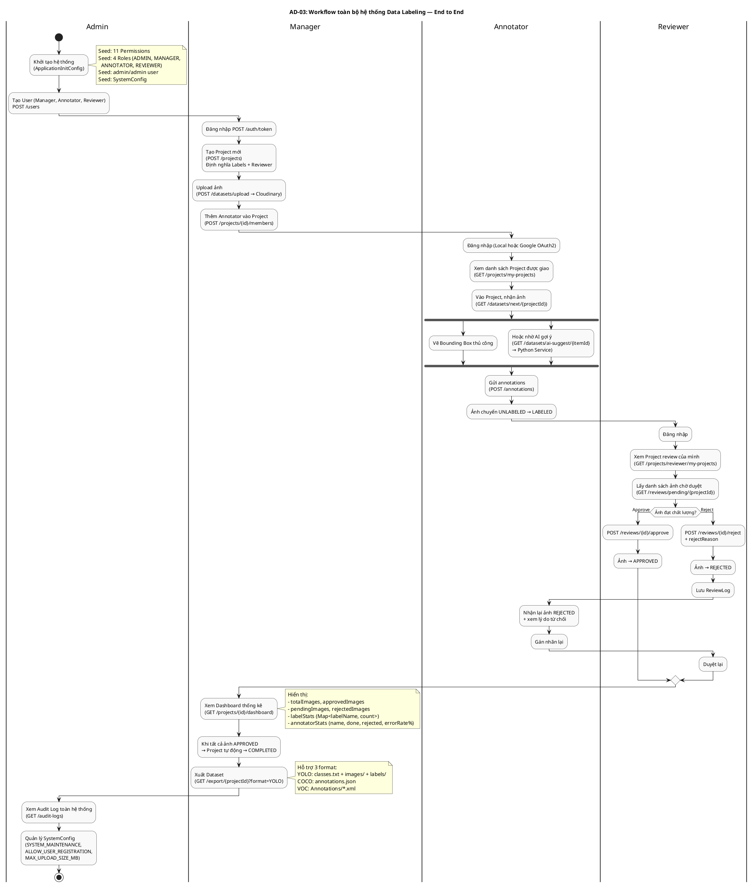
```plantuml
@startuml
skinparam ActivityBackgroundColor #f9f9f9
title AD-03: Workflow toàn bộ hệ thống Data Labeling — End to End

|Admin|
start
:Khởi tạo hệ thống\n(ApplicationInitConfig);
note right
  Seed: 11 Permissions
  Seed: 4 Roles (ADMIN, MANAGER,
    ANNOTATOR, REVIEWER)
  Seed: admin/admin user
  Seed: SystemConfig
end note
:Tạo User (Manager, Annotator, Reviewer)\nPOST /users;

|Manager|
:Đăng nhập POST /auth/token;
:Tạo Project mới\n(POST /projects)\nĐịnh nghĩa Labels + Reviewer;
:Upload ảnh\n(POST /datasets/upload → Cloudinary);
:Thêm Annotator vào Project\n(POST /projects/{id}/members);

|Annotator|
:Đăng nhập (Local hoặc Google OAuth2);
:Xem danh sách Project được giao\n(GET /projects/my-projects);
:Vào Project, nhận ảnh\n(GET /datasets/next/{projectId});

fork
  :Vẽ Bounding Box thủ công;
fork again
  :Hoặc nhờ AI gợi ý\n(GET /datasets/ai-suggest/{itemId}\n→ Python Service);
end fork

:Gửi annotations\n(POST /annotations);
:Ảnh chuyển UNLABELED → LABELED;

|Reviewer|
:Đăng nhập;
:Xem Project review của mình\n(GET /projects/reviewer/my-projects);
:Lấy danh sách ảnh chờ duyệt\n(GET /reviews/pending/{projectId});

if (Ảnh đạt chất lượng?) then (Approve)
  :POST /reviews/{id}/approve;
  :Ảnh → APPROVED;
else (Reject)
  :POST /reviews/{id}/reject\n+ rejectReason;
  :Ảnh → REJECTED;
  :Lưu ReviewLog;
  
  |Annotator|
  :Nhận lại ảnh REJECTED\n+ xem lý do từ chối;
  :Gán nhãn lại;
  
  |Reviewer|
  :Duyệt lại;
endif

|Manager|
:Xem Dashboard thống kê\n(GET /projects/{id}/dashboard);
note right
  Hiển thị:
  - totalImages, approvedImages
  - pendingImages, rejectedImages
  - labelStats (Map<labelName, count>)
  - annotatorStats (name, done, rejected, errorRate%)
end note

:Khi tất cả ảnh APPROVED\n→ Project tự động → COMPLETED;
:Xuất Dataset\n(GET /export/{projectId}?format=YOLO);
note right
  Hỗ trợ 3 format:
  YOLO: classes.txt + images/ + labels/
  COCO: annotations.json
  VOC: Annotations/*.xml
end note

|Admin|
:Xem Audit Log toàn hệ thống\n(GET /audit-logs);
:Quản lý SystemConfig\n(SYSTEM_MAINTENANCE,\nALLOW_USER_REGISTRATION,\nMAX_UPLOAD_SIZE_MB);

stop
@enduml
```

---

## 4.4 Class Diagram — Đầy đủ tất cả Entity, Attribute, Relationship

Bao gồm đầy đủ 12 Entity classes với tất cả attributes và relationships được trích xuất từ source code.


```plantuml
@startuml
skinparam classAttributeIconSize 0
skinparam classFontSize 11
hide circle
left to right direction

package "Entity Layer" {

  class User {
    - id : String <<UUID, PK, @GeneratedValue>>
    - username : String
    - password : String
    - firstName : String
    - lastName : String
    - email : String
    - dateOfBirth : LocalDate
    --
    + roles : Set<Role> <<@ManyToMany>>
  }

  class Role {
    - name : String <<PK, @Id>>
    - description : String
    --
    + permissions : Set<Permission> <<@ManyToMany>>
  }

  class Permission {
    - name : String <<PK, @Id>>
    - description : String
  }

  class Project {
    - id : String <<UUID, PK>>
    - name : String
    - description : String <<TEXT>>
    - status : ProjectStatus <<ENUM>>
    - createdAt : LocalDateTime
    - updatedAt : LocalDateTime
    --
    + manager : User <<@ManyToOne, FK=manager_id>>
    + reviewer : User <<@ManyToOne, FK=reviewer_id>>
    + labels : List<Label> <<@OneToMany, cascade=ALL>>
    + dataItems : List<DataItem> <<@OneToMany, cascade=ALL>>
    + members : Set<ProjectMember> <<@OneToMany, cascade=ALL, orphanRemoval>>
    --
    <<@PrePersist>> onCreate() : void
  }

  class ProjectMember {
    - id : String <<UUID, PK>>
    --
    + project : Project <<@ManyToOne, FK=project_id>>
    + user : User <<@ManyToOne, FK=user_id>>
  }

  class Label {
    - id : String <<UUID, PK>>
    - name : String
    - color : String <<HEX: #FF5733>>
    --
    + project : Project <<@ManyToOne, FK=project_id, @JsonIgnore>>
  }

  class DataItem {
    - id : String <<UUID, PK>>
    - fileName : String
    - fileUrl : String <<TEXT, Cloudinary URL>>
    - rejectReason : String
    - status : DataItemStatus <<ENUM>>
    --
    + project : Project <<@ManyToOne, FK=project_id, @JsonIgnore>>
    + annotations : List<Annotation> <<@OneToMany, cascade=ALL, orphanRemoval>>
  }

  class Annotation {
    - id : String <<UUID, PK>>
    - xCenter : double
    - yCenter : double
    - width : double
    - height : double
    --
    + label : Label <<@ManyToOne, FK=label_id>>
    + dataItem : DataItem <<@ManyToOne, FK=data_item_id, @JsonIgnore>>
    + annotator : User <<@ManyToOne, FK=user_id>>
  }

  class ReviewLog {
    - id : String <<UUID, PK>>
    - comment : String <<TEXT, NOT NULL>>
    - createdAt : LocalDateTime <<@CreationTimestamp>>
    --
    + dataItem : DataItem <<@ManyToOne, FK=data_item_id, LAZY>>
    + reviewer : User <<@ManyToOne, FK=reviewer_id, LAZY>>
  }

  class AuditLog {
    - id : String <<UUID, PK>>
    - username : String
    - action : String
    - targetEntity : String
    - details : String
    - ipAddress : String
    - status : String
    - timestamp : LocalDateTime <<@CreationTimestamp>>
  }

  class InvalidatedToken {
    - id : String <<PK, JWT JTI>>
    - expiryTime : Date
  }

  class SystemConfig {
    - key : String <<PK, @Id>>
    - value : String
    - description : String
  }

  enum ProjectStatus {
    DRAFT
    IN_PROGRESS
    COMPLETED
  }

  enum DataItemStatus {
    UNLABELED
    LABELED
    APPROVED
    REJECTED
  }
}

' === RELATIONSHIPS ===
User "1" -- "*" Role : <<@ManyToMany>>
Role "1" -- "*" Permission : <<@ManyToMany>>

Project "*" --> "1" User : manager\n<<FK: manager_id>>
Project "*" --> "1" User : reviewer\n<<FK: reviewer_id>>
Project "1" *-- "*" Label : labels\n<<cascade=ALL>>
Project "1" *-- "*" DataItem : dataItems\n<<cascade=ALL>>
Project "1" *-- "*" ProjectMember : members\n<<cascade=ALL, orphanRemoval>>

ProjectMember "*" --> "1" User : user
ProjectMember "*" --> "1" Project : project

DataItem "1" *-- "*" Annotation : annotations\n<<cascade=ALL, orphanRemoval>>

Annotation "*" --> "1" Label : label
Annotation "*" --> "1" User : annotator
Annotation "*" --> "1" DataItem : dataItem

ReviewLog "*" --> "1" DataItem : dataItem
ReviewLog "*" --> "1" User : reviewer

Project --> ProjectStatus
DataItem --> DataItemStatus
@enduml
```

---

## 4.5 Entity-Relationship (ER) Diagram — Đầy đủ tất cả bảng và cột

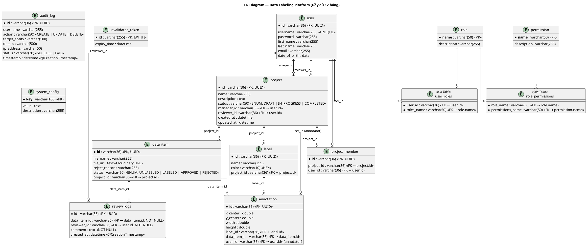
```plantuml
@startuml
skinparam linetype ortho
title ER Diagram — Data Labeling Platform (Đầy đủ 12 bảng)

entity "user" as u {
  * **id** : varchar(36) <<PK, UUID>>
  --
  username : varchar(255) <<UNIQUE>>
  password : varchar(255)
  first_name : varchar(255)
  last_name : varchar(255)
  email : varchar(255)
  date_of_birth : date
}

entity "role" as r {
  * **name** : varchar(50) <<PK>>
  --
  description : varchar(255)
}

entity "permission" as perm {
  * **name** : varchar(50) <<PK>>
  --
  description : varchar(255)
}

entity "user_roles" as ur <<Join Table>> {
  * user_id : varchar(36) <<FK → user.id>>
  * roles_name : varchar(50) <<FK → role.name>>
}

entity "role_permissions" as rp <<Join Table>> {
  * role_name : varchar(50) <<FK → role.name>>
  * permissions_name : varchar(50) <<FK → permission.name>>
}

entity "project" as p {
  * **id** : varchar(36) <<PK, UUID>>
  --
  name : varchar(255)
  description : text
  status : varchar(50) <<ENUM: DRAFT | IN_PROGRESS | COMPLETED>>
  manager_id : varchar(36) <<FK → user.id>>
  reviewer_id : varchar(36) <<FK → user.id>>
  created_at : datetime
  updated_at : datetime
}

entity "project_member" as pm {
  * **id** : varchar(36) <<PK, UUID>>
  --
  project_id : varchar(36) <<FK → project.id>>
  user_id : varchar(36) <<FK → user.id>>
}

entity "label" as l {
  * **id** : varchar(36) <<PK, UUID>>
  --
  name : varchar(255)
  color : varchar(10) <<HEX>>
  project_id : varchar(36) <<FK → project.id>>
}

entity "data_item" as d {
  * **id** : varchar(36) <<PK, UUID>>
  --
  file_name : varchar(255)
  file_url : text <<Cloudinary URL>>
  reject_reason : varchar(255)
  status : varchar(50) <<ENUM: UNLABELED | LABELED | APPROVED | REJECTED>>
  project_id : varchar(36) <<FK → project.id>>
}

entity "annotation" as a {
  * **id** : varchar(36) <<PK, UUID>>
  --
  x_center : double
  y_center : double
  width : double
  height : double
  label_id : varchar(36) <<FK → label.id>>
  data_item_id : varchar(36) <<FK → data_item.id>>
  user_id : varchar(36) <<FK → user.id>> (annotator)
}

entity "review_logs" as rl {
  * **id** : varchar(36) <<PK, UUID>>
  --
  data_item_id : varchar(36) <<FK → data_item.id, NOT NULL>>
  reviewer_id : varchar(36) <<FK → user.id, NOT NULL>>
  comment : text <<NOT NULL>>
  created_at : datetime <<@CreationTimestamp>>
}

entity "audit_log" as al {
  * **id** : varchar(36) <<PK, UUID>>
  --
  username : varchar(255)
  action : varchar(50) <<CREATE | UPDATE | DELETE>>
  target_entity : varchar(100)
  details : varchar(500)
  ip_address : varchar(50)
  status : varchar(20) <<SUCCESS | FAIL>>
  timestamp : datetime <<@CreationTimestamp>>
}

entity "invalidated_token" as it {
  * **id** : varchar(255) <<PK, JWT JTI>>
  --
  expiry_time : datetime
}

entity "system_config" as sc {
  * **key** : varchar(100) <<PK>>
  --
  value : text
  description : varchar(255)
}

' === RELATIONSHIPS ===
u ||--o{ ur
r ||--o{ ur
r ||--o{ rp
perm ||--o{ rp
u ||--o{ p : "manager_id"
u ||--o{ p : "reviewer_id"
u ||--o{ pm : "user_id"
p ||--o{ pm : "project_id"
p ||--o{ l : "project_id"
p ||--o{ d : "project_id"
l ||--o{ a : "label_id"
d ||--o{ a : "data_item_id"
u ||--o{ a : "user_id (annotator)"
d ||--o{ rl : "data_item_id"
u ||--o{ rl : "reviewer_id"
@enduml
```

### 4.5.1 State Diagram — DataItemStatus (Máy trạng thái)

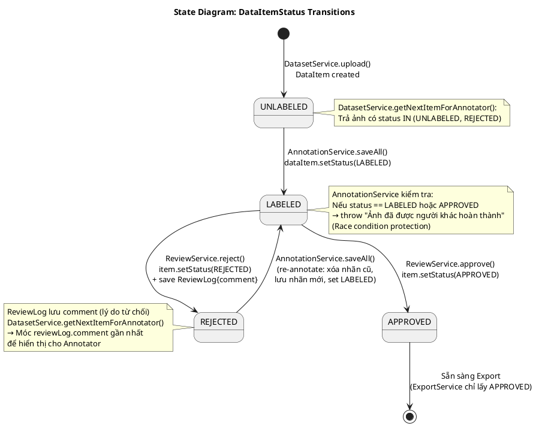
```plantuml
@startuml
skinparam StateBackgroundColor #f0f0f0
title State Diagram: DataItemStatus Transitions

[*] --> UNLABELED : DatasetService.upload()\nDataItem created

UNLABELED --> LABELED : AnnotationService.saveAll()\ndataItem.setStatus(LABELED)

LABELED --> APPROVED : ReviewService.approve()\nitem.setStatus(APPROVED)

LABELED --> REJECTED : ReviewService.reject()\nitem.setStatus(REJECTED)\n+ save ReviewLog{comment}

REJECTED --> LABELED : AnnotationService.saveAll()\n(re-annotate: xóa nhãn cũ,\nlưu nhãn mới, set LABELED)

APPROVED --> [*] : Sẵn sàng Export\n(ExportService chỉ lấy APPROVED)

note right of UNLABELED
  DatasetService.getNextItemForAnnotator():
  Trả ảnh có status IN (UNLABELED, REJECTED)
end note

note right of LABELED
  AnnotationService kiểm tra:
  Nếu status == LABELED hoặc APPROVED
  → throw "Ảnh đã được người khác hoàn thành"
  (Race condition protection)
end note

note left of REJECTED
  ReviewLog lưu comment (lý do từ chối)
  DatasetService.getNextItemForAnnotator()
  → Móc reviewLog.comment gần nhất
  để hiển thị cho Annotator
end note
@enduml
```

### 4.5.2 State Diagram — ProjectStatus (Máy trạng thái)

```plantuml
@startuml
skinparam StateBackgroundColor #f0f0f0
title State Diagram: ProjectStatus Transitions

[*] --> DRAFT : Project.@PrePersist\nstatus = DRAFT

DRAFT --> IN_PROGRESS : ProjectService.getAllProjects()\ntotalItems > 0 AND\napprovedItems < totalItems

IN_PROGRESS --> COMPLETED : ProjectService.getAllProjects()\napprovedItems == totalItems

COMPLETED --> IN_PROGRESS : DatasetService.uploadAndSaveDataset()\nUpload ảnh mới vào Project COMPLETED\n→ currentProject.setStatus(IN_PROGRESS)

COMPLETED --> [*] : Export dataset\n(chỉ lấy ảnh APPROVED)

note bottom of DRAFT
  Trạng thái khởi tạo.
  Chưa có DataItem nào.
end note

note bottom of IN_PROGRESS
  **Tự động tính toán** trong getAllProjects():
  Service đếm totalItems và approvedItems
  rồi so sánh với status hiện tại.
  Nếu khác → tự động save() vào DB.
end note
@enduml
```

---

# 5. Requirement Traceability Matrix (RTM)

Bảng RTM đảm bảo tất cả yêu cầu được ánh xạ tới Use Case, API endpoint, DB Entity, và Diagram PlantUML tương ứng.

| Req ID | Mô tả yêu cầu | Use Case | API Endpoint | DB Entity | Diagram |
|--------|----------------|----------|--------------|-----------|---------|
| FR-01a | Đăng nhập Local | UC-01 | POST /auth/token | User, InvalidatedToken | SD-01 |
| FR-01b | Đăng nhập Google OAuth2 | UC-02 | POST /auth/google | User, Role | SD-02 |
| FR-01c | Đăng xuất (Logout) | UC-03 | POST /auth/logout | InvalidatedToken | SD-03 |
| FR-01d | Refresh Token | UC-04 | POST /auth/refresh | InvalidatedToken | SD-03 |
| FR-01e | Introspect Token | UC-05 | POST /auth/introspect | InvalidatedToken | SD-10 |
| FR-01f | Đăng ký tài khoản | UC-06 | POST /register | User, Role | SD-09 |
| FR-02a | Tạo User (Admin) | UC-07 | POST /users | User, Role | SD-09 |
| FR-02b | Xem danh sách User | UC-08 | GET /users | User | - |
| FR-02c | Cập nhật User | UC-09 | PUT /users/{id} | User, Role | - |
| FR-02d | Xóa User | UC-10 | DELETE /users/{id} | User | - |
| FR-02e | Xem thông tin cá nhân | UC-11 | GET /users/myInfor | User | - |
| FR-03a | Tạo Project mới | UC-12 | POST /projects | Project, Label, AuditLog | SD-04 |
| FR-03b | Xem danh sách Project | UC-13 | GET /projects | Project, DataItem | AD-02 |
| FR-03c | Cập nhật Project | UC-14 | PUT /projects/{id} | Project, AuditLog | - |
| FR-03d | Xóa Project | UC-15 | DELETE /projects/{id} | Project, AuditLog | - |
| FR-03e | Thêm thành viên | UC-16 | POST /projects/{id}/members | ProjectMember | SD-04 |
| FR-03f | Xóa thành viên | UC-17 | DELETE /projects/{id}/members/{userId} | ProjectMember | - |
| FR-03g | Dashboard thống kê | UC-18 | GET /projects/{id}/dashboard | DataItem, Annotation | AD-03 |
| FR-03h | Xem Project được giao | UC-19 | GET /projects/my-projects | Project, ProjectMember | AD-03 |
| FR-04a | Upload ảnh | UC-20 | POST /datasets/upload | DataItem, Project | SD-05 |
| FR-04b | Xem danh sách ảnh | UC-21 | GET /datasets/project/{id} | DataItem, ReviewLog | - |
| FR-04c | Xóa ảnh | UC-22 | DELETE /datasets/{id} | DataItem, AuditLog | - |
| FR-04d | Lấy ảnh tiếp theo | UC-23 | GET /datasets/next/{projectId} | DataItem, ReviewLog | AD-01 |
| FR-04e | Gợi ý AI | UC-24 | GET /datasets/ai-suggest/{itemId} | DataItem | AD-03 |
| FR-05a | Gán nhãn Bounding Box | UC-25 | POST /annotations | Annotation, DataItem, Label | SD-06 |
| FR-05b | Xem nhãn đã gán | UC-26 | GET /annotations/item/{itemId} | Annotation | - |
| FR-06a | Xem ảnh chờ duyệt | UC-27 | GET /reviews/pending/{projectId} | DataItem | SD-07 |
| FR-06b | Duyệt ảnh (Approve) | UC-28 | POST /reviews/{id}/approve | DataItem | SD-07 |
| FR-06c | Từ chối ảnh (Reject) | UC-29 | POST /reviews/{id}/reject | DataItem, ReviewLog | SD-07 |
| FR-06d | Xem Project review | UC-30 | GET /projects/reviewer/my-projects | Project | AD-03 |
| FR-07a | Xuất Dataset YOLO | UC-31 | GET /export/{projectId}?format=YOLO | DataItem, Annotation, Label | SD-08 |
| FR-07b | Xuất Dataset COCO | UC-32 | GET /export/{projectId}?format=COCO | DataItem, Annotation, Label | SD-08 |
| FR-07c | Xuất Dataset VOC | UC-33 | GET /export/{projectId}?format=VOC | DataItem, Annotation, Label | SD-08 |
| FR-08a | Quản lý Role | UC-34 | POST/GET/DELETE /roles | Role, Permission | - |
| FR-08b | Quản lý Permission | UC-35 | POST/GET/DELETE /permissions | Permission | - |
| FR-08c | Cấu hình hệ thống | UC-36 | POST/GET /system-configs | SystemConfig | SD-01 |
| FR-08d | Xem Audit Log | UC-37 | GET /audit-logs | AuditLog | AD-03 |
| NFR-01 | JWT Security (HS512) | UC-01~05 | SecurityFilterChain | InvalidatedToken | SD-10 |
| NFR-02 | RBAC Authorization | All | @PreAuthorize | Role, Permission | SD-10 |
| NFR-03 | Password Hashing | UC-06/07 | UserService | User | SD-09 |
| NFR-04 | Maintenance Mode | UC-01/06 | AuthService/UserService | SystemConfig | SD-01 |
| NFR-05 | File Size Limit | UC-20 | DatasetService | SystemConfig | SD-05 |

---
**End of Document**

